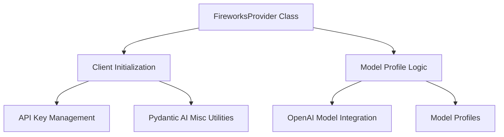

# FireworksProvider Module Documentation

<!-- DIAGRAM_JSON
{
    "direction": "TD",
    "nodes": [
        {"id": "fireworks_provider_class", "label": "FireworksProvider Class", "type": "component", "link": null},
        {"id": "model_profile_logic", "label": "Model Profile Logic", "type": "component", "link": null},
        {"id": "client_initialization", "label": "Client Initialization", "type": "component", "link": null},
        {"id": "api_key_management", "label": "API Key Management", "type": "component", "link": null},
        {"id": "openai_model_integration", "label": "OpenAI Model Integration", "type": "external", "link": "pydantic_ai_models.md"},
        {"id": "model_profiles", "label": "Model Profiles", "type": "external", "link": "pydantic_ai_providers.md"},
        {"id": "pydantic_ai_misc_utils", "label": "Pydantic AI Misc Utilities", "type": "external", "link": "pydantic_ai_misc.md"}
    ],
    "edges": [
        {"source": "fireworks_provider_class", "target": "client_initialization"},
        {"source": "fireworks_provider_class", "target": "model_profile_logic"},
        {"source": "client_initialization", "target": "api_key_management"},
        {"source": "client_initialization", "target": "pydantic_ai_misc_utils"},
        {"source": "model_profile_logic", "target": "openai_model_integration"},
        {"source": "model_profile_logic", "target": "model_profiles"}
    ],
    "groups": []
}
-->

### Introduction

The `fireworks_provider` module provides a robust and flexible integration for interacting with the Fireworks AI API within the larger system. It leverages an OpenAI-compatible interface, enabling seamless communication with various Fireworks models while abstracting away underlying API complexities.

### Module Purpose and Core Functionality

The primary purpose of the `fireworks_provider` module is to serve as an adapter for Fireworks AI models. It encapsulates the logic required to initialize the Fireworks API client, manage API keys, and dynamically determine the appropriate model profiles for different Fireworks models. Its core functionality revolves around the `FireworksProvider` class, which: 

*   **Acts as a Provider**: Implements the `Provider` interface, specifically for `AsyncOpenAI` clients, signifying its role in supplying an OpenAI-compatible client for Fireworks models.
*   **Handles API Key Management**: Manages the retrieval of the Fireworks API key from environment variables or direct constructor arguments, ensuring secure and flexible configuration.
*   **Initializes API Client**: Configures and initializes an `AsyncOpenAI` client, setting the correct base URL for the Fireworks AI API (`https://api.fireworks.ai/inference/v1`). It also integrates with a cached asynchronous HTTP client for efficient connection management.
*   **Maps Model Profiles**: Provides a static method, `model_profile`, to dynamically map specific Fireworks model names (e.g., those starting with 'llama', 'qwen', 'deepseek', 'mistral', 'gemma') to their corresponding predefined model profiles (e.g., `meta_model_profile`, `qwen_model_profile`). This method then enhances these profiles with `OpenAIModelProfile` and `OpenAIJsonSchemaTransformer` to ensure broad compatibility with OpenAI's API structure, enabling the system to interact with Fireworks models using a consistent interface.

### Architecture and Component Relationships

The `fireworks_provider` module is centered around the `FireworksProvider` class, which integrates several key components:

*   **`FireworksProvider` Class**: The main class (`pydantic_ai_slim.pydantic_ai.providers.fireworks.FireworksProvider`) that orchestrates interactions with the Fireworks AI API. It exposes properties like `name` and `base_url` for identifying the provider and its endpoint.
*   **Client Initialization**: This internal logic within the `FireworksProvider` constructor is responsible for setting up the `AsyncOpenAI` client. It considers various initialization scenarios, including direct `AsyncOpenAI` client injection or constructing one using an API key and a potentially cached HTTP client.
*   **API Key Management**: An integral part of the client initialization process, ensuring that the `FIREWORKS_API_KEY` is correctly sourced and applied.
*   **Model Profile Logic**: Encapsulated within the `model_profile` static method, this component determines the appropriate `ModelProfile` for a given Fireworks model. It relies on external model definitions and then adapts them for OpenAI compatibility.

### How the module fits into the overall system

The `fireworks_provider` module plays a crucial role within the [pydantic_ai_providers](pydantic_ai_providers.md) ecosystem by extending the system's capabilities to include models hosted on the Fireworks AI platform. As a member of the `openai_compatible_providers` group, it provides a standardized way to interact with Fireworks models, leveraging the common `AsyncOpenAI` client interface.

It seamlessly integrates with:

*   **[Pydantic AI Models](pydantic_ai_models.md)**: By utilizing `OpenAIModelProfile` and `OpenAIJsonSchemaTransformer`, it ensures that Fireworks models behave consistently with other OpenAI-compatible models within the system, particularly regarding request and response handling and schema transformations.
*   **[Model Profiles](pydantic_ai_providers.md)**: It depends on the broader model profiling system to accurately categorize and configure various Fireworks models based on their underlying architectures (e.g., Llama, Qwen, DeepSeek). This allows the system to apply model-specific optimizations and behaviors.
*   **[Pydantic AI Misc Utilities](pydantic_ai_misc.md)**: It uses shared utility functions, such as a cached asynchronous HTTP client, to optimize network interactions and improve performance across different providers.

This integration allows developers and users to interchangeably use Fireworks AI models alongside other supported AI providers, maintaining a consistent API and development experience across the entire platform.