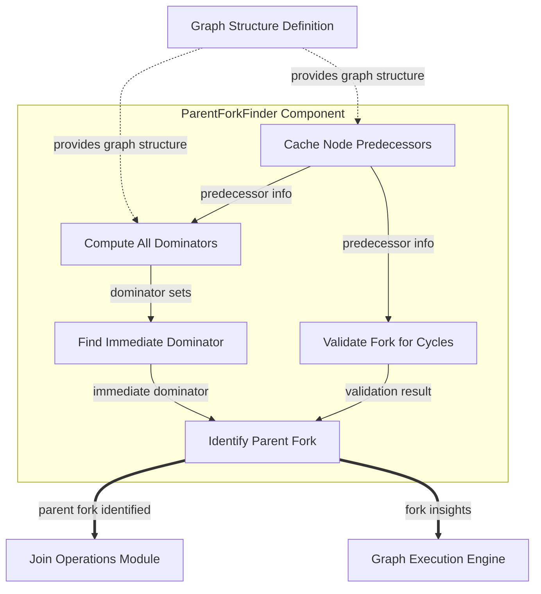

# `fork_management` Module Documentation

## Introduction

The `fork_management` module is a critical component within the Pydantic AI Agent Core, specifically designed to analyze and manage "forks" and "joins" in execution graphs. Its primary purpose is to identify and validate parent forks for join nodes, which is essential for orchestrating correct parallel execution, preventing deadlocks, and maintaining the structural integrity of complex computational graphs.

In graph-based systems, a **fork** is a point where a single execution path splits into multiple parallel paths, and a **join** is a point where these parallel paths converge back into a single path. Accurate management of these constructs is fundamental for reliable and efficient graph execution, especially in AI agents that might involve concurrent task processing or decision-making.

## Core Components

The `fork_management` module primarily exposes the `ParentForkFinder` class, which encapsulates the logic for identifying and validating parent forks.

### `ParentForkFinder`

```python
class ParentForkFinder(Generic[T]):
    """Analyzes graph structure to identify parent forks for join nodes.

    This class implements algorithms to find dominating forks in a directed graph,
    which is essential for coordinating parallel execution and avoiding deadlocks.
    """
    # ... (rest of the class definition)
```

The `ParentForkFinder` class is initialized with the graph's topology, including its nodes, starting points (`start_ids`), identified fork nodes (`fork_ids`), and the graph's edges. It then uses a suite of graph theory algorithms to perform its analysis:

*   **`_predecessors`**: This internal property efficiently computes and caches a mapping of each node to its immediate predecessors. This is a foundational step for any backward traversal or dominator analysis within the graph.

*   **`_dominators`**: This property calculates the set of dominators for every node in the graph using an iterative dataflow analysis. A node `D` dominates node `N` if every possible path from any start node to `N` must pass through `D`. Identifying dominators is crucial for understanding control flow and dependencies in the graph.

*   **`_immediate_dominator`**: Building upon the dominator sets, this method finds the "closest" dominator to a given node (excluding the node itself). The immediate dominator forms the direct parent in a dominator tree, providing a clearer hierarchical view of control flow.

*   **`_get_upstream_nodes_if_parent`**: This critical method validates whether a proposed `fork_id` can legitimately serve as a parent for a `join_id`. It does so by checking for potential cycles in the graph that might bypass the `fork_id` and still reach the `join_id`. If such a cycle exists, the `fork_id` is deemed invalid as a parent, as it would lead to incorrect synchronization or deadlocks. If valid, it also returns all nodes upstream of the join that are part of the fork's controlled path.

*   **`find_parent_fork`**: This is the main public method. Given a `join_id`, it intelligently searches for the most appropriate parent fork. It can either validate a manually specified `parent_fork_id` or automatically discover the most ancestral (or closest, based on configuration) dominating fork that passes the cycle validation performed by `_get_upstream_nodes_if_parent`. This ensures that any identified parent fork genuinely orchestrates the parallel execution leading to the join.

## Why This Module Matters

Proper fork management is indispensable for systems involving parallel processing or complex graph-based execution, such as those found in advanced AI agents. Without a robust mechanism like `fork_management`, systems face significant risks:

*   **Deadlocks**: A join node might perpetually wait for a branch that was not correctly initiated by its expected parent fork, or one that has been inadvertently bypassed, leading to system halts.
*   **Incorrect Data Aggregation**: If parallel execution paths are not properly synchronized and managed by a valid parent fork, the data aggregated at a join node can be inconsistent, incomplete, or erroneous.
*   **Increased Complexity in Debugging**: Issues arising from mismanaged parallel execution are notoriously difficult to trace and debug, consuming significant development resources.

By providing sophisticated graph analysis capabilities, this module lays the groundwork for `pydantic_ai_agent_core` to manage concurrent operations effectively and reliably, ensuring stable and predictable behavior.

## How It Connects to the Rest of the System

The `fork_management` module plays a foundational role in the overall graph execution framework:

*   **[graph_structure_definition](graph_structure_definition.md)**: This module provides the raw graph data (nodes, edges, start points, fork points) that `ParentForkFinder` consumes to perform its analysis.
*   **[join_operations](join_operations.md)**: The sibling `join_operations` module directly utilizes the output of `fork_management`. Once `ParentForkFinder` identifies a valid parent fork for a join, `join_operations` can then proceed with the correct synchronization and aggregation of results from the parallel branches.
*   **[graph_execution_engine](graph_execution_engine.md)**: The higher-level `graph_execution_engine` relies on the insights provided by `fork_management` to schedule and manage tasks in parallel effectively, ensuring that execution respects the graph's concurrency constraints and avoids potential deadlocks.

<!-- DIAGRAM_JSON
{
    "direction": "TD",
    "nodes": [
        {
            "id": "find_parent_fork_node",
            "label": "Identify Parent Fork",
            "type": "component",
            "link": null
        },
        {
            "id": "predecessors_cache",
            "label": "Cache Node Predecessors",
            "type": "component",
            "link": null
        },
        {
            "id": "dominators_compute",
            "label": "Compute All Dominators",
            "type": "component",
            "link": null
        },
        {
            "id": "immediate_dominator_find",
            "label": "Find Immediate Dominator",
            "type": "component",
            "link": null
        },
        {
            "id": "validate_fork_cycles",
            "label": "Validate Fork for Cycles",
            "type": "component",
            "link": null
        },
        {
            "id": "join_operations_module",
            "label": "Join Operations Module",
            "type": "external",
            "link": "join_operations.md"
        },
        {
            "id": "graph_execution_engine_module",
            "label": "Graph Execution Engine",
            "type": "external",
            "link": "graph_execution_engine.md"
        },
        {
            "id": "graph_structure_definition_module",
            "label": "Graph Structure Definition",
            "type": "external",
            "link": "graph_structure_definition.md"
        }
    ],
    "edges": [
        {
            "source": "graph_structure_definition_module",
            "target": "predecessors_cache",
            "label": "provides graph structure"
        },
        {
            "source": "graph_structure_definition_module",
            "target": "dominators_compute",
            "label": "provides graph structure"
        },
        {
            "source": "predecessors_cache",
            "target": "dominators_compute",
            "label": "predecessor info"
        },
        {
            "source": "predecessors_cache",
            "target": "validate_fork_cycles",
            "label": "predecessor info"
        },
        {
            "source": "dominators_compute",
            "target": "immediate_dominator_find",
            "label": "dominator sets"
        },
        {
            "source": "immediate_dominator_find",
            "target": "find_parent_fork_node",
            "label": "immediate dominator"
        },
        {
            "source": "validate_fork_cycles",
            "target": "find_parent_fork_node",
            "label": "validation result"
        },
        {
            "source": "find_parent_fork_node",
            "target": "join_operations_module",
            "label": "parent fork identified"
        },
        {
            "source": "find_parent_fork_node",
            "target": "graph_execution_engine_module",
            "label": "fork insights"
        }
    ],
    "groups": [
        {
            "id": "parent_fork_finder_component",
            "label": "ParentForkFinder Component",
            "role": "core_logic",
            "nodes": [
                "find_parent_fork_node",
                "predecessors_cache",
                "dominators_compute",
                "immediate_dominator_find",
                "validate_fork_cycles"
            ]
        }
    ]
}
-->

