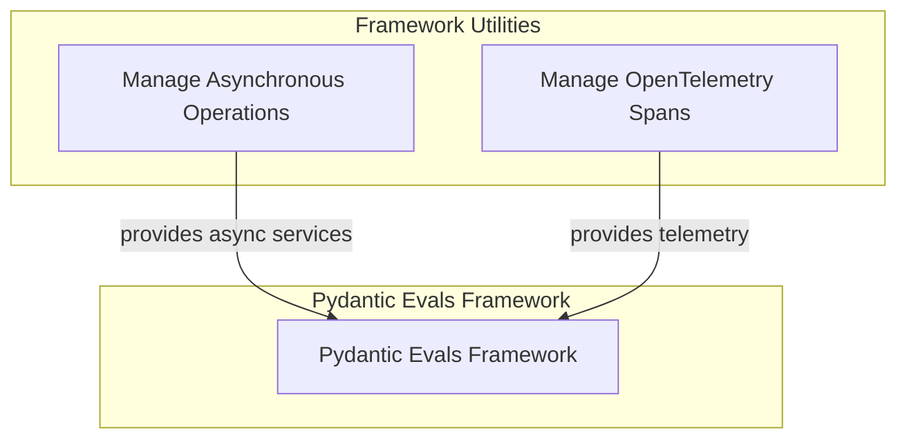

# Framework Utilities Module Documentation

## Introduction

The `framework_utilities` module serves as a foundational collection of helper functions and tools that support various essential aspects of the `pydantic_evals` framework. It encapsulates common functionalities ranging from asynchronous operation management to integration with observability tools, ensuring robust and efficient operation across the system.

This module is critical for providing underlying mechanisms that other parts of the framework leverage, promoting code reusability and maintaining a clean separation of concerns. By centralizing these utilities, the framework enhances its maintainability and allows for consistent application of core operational patterns.

## Architecture Overview

The `framework_utilities` module is designed to be a supportive layer for the `pydantic_evals` framework. It comprises distinct sub-modules, each addressing a specific utility domain. These sub-modules do not typically interact directly with each other in a sequential workflow but rather expose functionalities that are consumed by higher-level modules within the `pydantic_evals` ecosystem. The architecture emphasizes loose coupling, allowing individual utilities to evolve independently while still providing cohesive support to the overall framework.

<!-- DIAGRAM_JSON
{
    "direction": "TD",
    "nodes": [
        {"id": "asynchronous_utilities", "label": "Manage Asynchronous Operations", "type": "module", "link": "asynchronous_utilities.md"},
        {"id": "observability_utilities", "label": "Manage OpenTelemetry Spans", "type": "module", "link": "observability_utilities.md"},
        {"id": "pydantic_evals_framework_node", "label": "Pydantic Evals Framework", "type": "external"}
    ],
    "edges": [
        {"source": "asynchronous_utilities", "target": "pydantic_evals_framework_node", "label": "provides async services"},
        {"source": "observability_utilities", "target": "pydantic_evals_framework_node", "label": "provides telemetry"}
    ],
    "groups": [
        {
            "id": "framework_utilities_group",
            "label": "Framework Utilities",
            "role": "analytical", 
            "nodes": ["asynchronous_utilities", "observability_utilities"]
        },
        {
            "id": "pydantic_evals_framework_group",
            "label": "Pydantic Evals",
            "role": "surface", 
            "nodes": ["pydantic_evals_framework_node"]
        }
    ]
}
-->

## Sub-modules

Below are the core sub-modules within `framework_utilities`, each offering specialized functionalities:

*   ### [Asynchronous Utilities](asynchronous_utilities.md)
    This sub-module provides essential tools for managing asynchronous operations, primarily focusing on event loop handling to ensure smooth and efficient execution of concurrent tasks within the framework.

*   ### [Observability Utilities](observability_utilities.md)
    This sub-module offers critical tools for integrating with OpenTelemetry, specifically designed for capturing and managing span trees within a given context, thereby enhancing the framework's monitoring and debugging capabilities.
