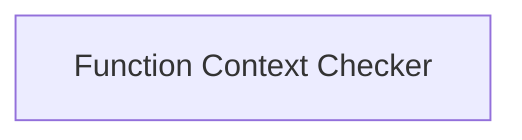

<!-- AUTO_GENERATED_PLACEHOLDER
  reason: LLM did not create .md file for this module
  module_path: pydantic_ai_agent_core/agent_utilities/type_and_schema_utilities/type_introspection/function_context_checker
  component_count: 1
  generated_at: 2026-04-06T06:47:34.930157
  TODO: Fix LLM prompt to handle small leaf modules
-->

# Function Context Checker

> ⚠️ **Auto-Generated Placeholder**
> This documentation was auto-generated because the LLM failed to create it.
> Module path: `pydantic_ai_agent_core/agent_utilities/type_and_schema_utilities/type_introspection/function_context_checker`

Determines if a given callable object expects a RunContext as its first argument, crucial for context-aware function execution.

## Components

This module contains 1 component(s):

- `pydantic_ai_slim.pydantic_ai._function_schema._takes_ctx`

## Structure

---
*Auto-generated placeholder. See sync_issues.json for details.*
