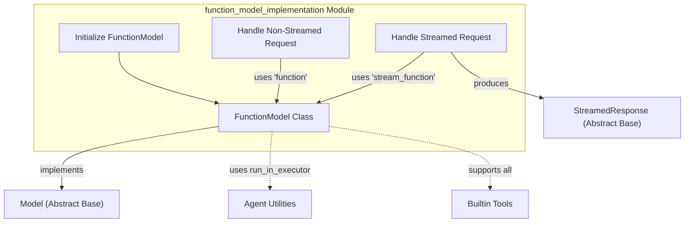

# Function Model Implementation

The `function_model_implementation` module provides the `FunctionModel` class, a unique model implementation that allows developers to integrate custom Python functions as the underlying "intelligence" of an AI agent. Instead of making calls to external Large Language Models (LLMs), `FunctionModel` executes local functions to generate responses, making it ideal for testing, mocking, or building agents with highly specific, deterministic behaviors.

This module is crucial for scenarios where:
*   **Local Execution and Testing:** Rapidly test agent logic without incurring costs or network latency associated with external LLMs.
*   **Deterministic Behavior:** Implement agents that follow predefined rules or algorithms for specific tasks.
*   **Custom Logic Integration:** Seamlessly incorporate existing Python functions or business logic directly into the agent's decision-making process.
*   **Mocking:** Create mock models for unit and integration testing of agent workflows.

## How it Works

The `FunctionModel` extends the foundational [Model base definition](model_base_definitions.md) and offers implementations for both non-streamed (`request`) and streamed (`request_stream`) interactions. Its core functionality revolves around wrapping user-provided Python callables.

### Core Components

#### `FunctionModel`

The `FunctionModel` is the primary class in this module. It acts as an adapter, allowing any Python function or asynchronous function to conform to the `Model` interface.

*   **`__init__(self, function: FunctionDef | None = None, *, stream_function: StreamFunctionDef | None = None, model_name: str | None = None, profile: ModelProfileSpec | None = None, settings: ModelSettings | None = None)`**
    *   Initializes the `FunctionModel`. At least one of `function` or `stream_function` must be provided.
    *   `function`: A callable for non-streamed requests, expected to return a `ModelResponse`.
    *   `stream_function`: An asynchronous callable for streamed requests, expected to return an `AsyncIterator[StreamedResponse]`.
    *   `model_name`: An optional identifier for the model. If not provided, it's generated from the function names.
    *   `profile`: A [ModelProfile](model_provider_configurations.md) that describes the model's capabilities (e.g., JSON schema support). By default, it supports JSON schema and object output.
    *   `settings`: Model-specific configurations.

*   **`request(self, messages: list[ModelMessage], model_settings: ModelSettings | None, model_request_parameters: ModelRequestParameters) -> ModelResponse`**
    *   Handles non-streamed model requests.
    *   It prepares the request parameters and constructs an `AgentInfo` object containing context for the function call.
    *   It then invokes the `function` provided during initialization. If the `function` is synchronous, it's executed within a thread pool using `run_in_executor` from the [agent_utilities module](agent_utilities.md) to prevent blocking the event loop.
    *   The response's `model_name` is set, and usage data is estimated if not already present.

*   **`request_stream(self, messages: list[ModelMessage], model_settings: ModelSettings | None, model_request_parameters: ModelRequestParameters, run_context: RunContext[Any] | None = None) -> AsyncIterator[StreamedResponse]`**
    *   Manages streamed model requests.
    *   Similar to `request`, it prepares parameters and `AgentInfo`.
    *   It asserts that a `stream_function` was provided and then calls it, wrapping its output in a `PeekableAsyncStream`.
    *   It yields a `FunctionStreamedResponse` (a type of [StreamedResponse](streamed_responses.md)) which encapsulates the stream from the user-defined `stream_function`.

*   **`model_name` property:**
    *   Returns the name of the function model.

*   **`system` property:**
    *   Returns the system identifier, which is `'function'` for this model type.

*   **`supported_builtin_tools(cls) -> frozenset[type[AbstractBuiltinTool]]`**
    *   For testing flexibility, `FunctionModel` declares support for all [builtin_tools](builtin_tools.md).

### Connections to the System

`FunctionModel` integrates into the broader system by adhering to the `Model` abstract interface defined in the [model_base_definitions module](model_base_definitions.md). It receives `ModelProfileSpec`, `ModelSettings`, and `ModelRequestParameters` for configuration and context, which are common interfaces across different model implementations. For executing synchronous functions in an asynchronous context, it relies on `_utils.run_in_executor` from the [agent_utilities module](agent_utilities.md). When handling streamed responses, it produces an `AsyncIterator` of [StreamedResponse](streamed_responses.md) objects. Its ability to support all [builtin_tools](builtin_tools.md) makes it a versatile tool for testing and local development.

<!-- DIAGRAM_JSON
{
    "direction": "TD",
    "nodes": [
        {"id": "FunctionModel", "label": "FunctionModel Class", "type": "component", "link": null},
        {"id": "InitializeModel", "label": "Initialize FunctionModel", "type": "component", "link": null},
        {"id": "HandleNonStreamedRequest", "label": "Handle Non-Streamed Request", "type": "component", "link": null},
        {"id": "HandleStreamedRequest", "label": "Handle Streamed Request", "type": "component", "link": null},
        {"id": "ModelBase", "label": "Model (Abstract Base)", "type": "external", "link": "model_base_definitions.md"},
        {"id": "StreamedResponseBase", "label": "StreamedResponse (Abstract Base)", "type": "external", "link": "streamed_responses.md"},
        {"id": "FunctionUtilities", "label": "Agent Utilities", "type": "external", "link": "agent_utilities.md"},
        {"id": "BuiltinToolsModule", "label": "Builtin Tools", "type": "external", "link": "builtin_tools.md"}
    ],
    "edges": [
        {"source": "InitializeModel", "target": "FunctionModel", "label": "configures"},
        {"source": "FunctionModel", "target": "ModelBase", "label": "implements", "type": "solid"},
        {"source": "HandleNonStreamedRequest", "target": "FunctionModel", "label": "uses 'function'"},
        {"source": "HandleStreamedRequest", "target": "FunctionModel", "label": "uses 'stream_function'"},
        {"source": "FunctionModel", "target": "FunctionUtilities", "label": "uses run_in_executor"},
        {"source": "FunctionModel", "target": "BuiltinToolsModule", "label": "supports all"},
        {"source": "HandleStreamedRequest", "target": "StreamedResponseBase", "label": "produces"}
    ],
    "groups": []
}
-->

