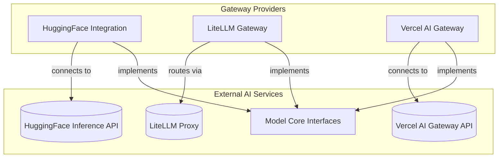

# Gateway Wrapper Providers

The `gateway_wrapper_providers` module provides a set of unified interfaces for interacting with various AI model gateways and third-party LLM services. It acts as an abstraction layer, allowing the core system to seamlessly integrate with different model providers like HuggingFace, LiteLLM, and Vercel AI Gateway without needing to manage their individual API specificities.

This module is crucial for enabling flexibility and extensibility within the AI framework, allowing developers to easily switch between or add new model providers as needed. It standardizes the interaction patterns with diverse AI services, from open-source models hosted on HuggingFace to aggregated services like LiteLLM, and enterprise solutions like Vercel AI Gateway.

## Architecture Overview

The `gateway_wrapper_providers` module integrates with external model providers, abstracting their unique APIs into a consistent interface. Each provider acts as a specialized client, routing requests and handling responses in a way that is compatible with the overall system's model interaction patterns. This setup ensures that the application logic remains decoupled from the specific implementation details of each external AI service.

<!-- DIAGRAM_JSON
{
    "direction": "TD",
    "nodes": [
        {
            "id": "gateway_wrapper_providers",
            "label": "Gateway and Wrapper Providers",
            "type": "module"
        },
        {
            "id": "huggingface_provider",
            "label": "HuggingFace Integration",
            "type": "module",
            "link": "huggingface_provider.md"
        },
        {
            "id": "litellm_provider",
            "label": "LiteLLM Gateway",
            "type": "module",
            "link": "litellm_provider.md"
        },
        {
            "id": "vercel_provider",
            "label": "Vercel AI Gateway",
            "type": "module",
            "link": "vercel_provider.md"
        },
        {
            "id": "huggingface_inference",
            "label": "HuggingFace Inference API",
            "type": "external",
            "_repaired": "g3_lifted_from_group"
        },
        {
            "id": "litellm_proxy",
            "label": "LiteLLM Proxy",
            "type": "external",
            "_repaired": "g3_lifted_from_group"
        },
        {
            "id": "vercel_ai_gateway",
            "label": "Vercel AI Gateway API",
            "type": "external",
            "_repaired": "g3_lifted_from_group"
        },
        {
            "id": "model_core_interfaces",
            "label": "Model Core Interfaces",
            "type": "module",
            "_repaired": "g3_lifted_from_group",
            "link": "model_core_interfaces.md"
        }
    ],
    "edges": [
        {
            "source": "huggingface_provider",
            "target": "model_core_interfaces",
            "label": "provides model access"
        },
        {
            "source": "litellm_provider",
            "target": "model_core_interfaces",
            "label": "provides model access"
        },
        {
            "source": "vercel_provider",
            "target": "model_core_interfaces",
            "label": "provides model access"
        }
    ],
    "groups": [
        {
            "id": "gateway_providers",
            "label": "Gateway Providers",
            "role": "surface",
            "nodes": [
                "huggingface_provider",
                "litellm_provider",
                "vercel_provider"
            ]
        },
        {
            "id": "external_systems",
            "label": "External AI Services",
            "role": "data",
            "nodes": [
                "huggingface_inference",
                "litellm_proxy",
                "vercel_ai_gateway",
                "model_core_interfaces"
            ]
        }
    ]
}
-->

## Sub-modules

Here are the key sub-modules within `gateway_wrapper_providers`:

*   **[HuggingFace Integration](huggingface_provider.md)**: Manages connections and interactions with HuggingFace models and their inference APIs. This includes handling authentication, model profiling, and request/response serialization specific to HuggingFace's ecosystem.

*   **[LiteLLM Gateway](litellm_provider.md)**: Provides a consolidated gateway to numerous LLM providers by leveraging the LiteLLM library. It abstracts away the complexities of integrating with diverse APIs, offering a uniform `AsyncOpenAI` compatible client interface.

*   **[Vercel AI Gateway](vercel_provider.md)**: Facilitates interaction with the Vercel AI Gateway, offering a streamlined way to access various AI models deployed via Vercel's infrastructure. It handles API key management and ensures requests conform to the Vercel AI Gateway's specifications.
