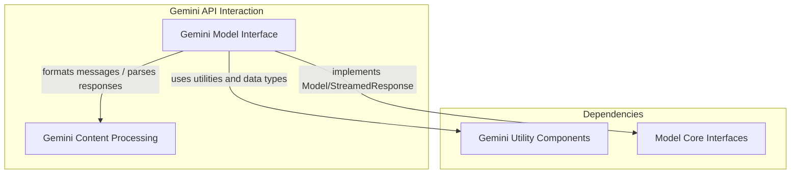

# Gemini API Interaction Module

## Introduction

The `gemini_api_interaction` module provides the core functionality for interfacing with Google's Gemini API. It encapsulates the complexities of making model requests, handling streamed responses, and converting various content formats to and from the Gemini API's specifications. This module is crucial for any agent or application within the system that needs to leverage Gemini models for generative AI tasks.

## Architecture Overview

This module is composed of two primary sub-modules: the `gemini_model_interface` and `gemini_content_processing`. The `gemini_model_interface` handles the direct communication with the Gemini API, managing both synchronous and asynchronous requests and their respective streamed or static responses. It relies heavily on `gemini_content_processing` to properly format messages before sending them to the API and to parse the API's responses into a usable format.

The module also interacts with `gemini_utility_components` for specific data structures and metadata handling, such as `_metadata_as_usage`, `_tool_config`, and data types for inline and file data.

<!-- DIAGRAM_JSON
{
    "direction": "TD",
    "nodes": [
        {"id": "gemini_model_interface", "label": "Gemini Model Interface", "type": "module", "link": "gemini_model_interface.md"},
        {"id": "gemini_content_processing", "label": "Gemini Content Processing", "type": "module", "link": "gemini_content_processing.md"},
        {"id": "gemini_utility_components", "label": "Gemini Utility Components", "type": "module", "link": "gemini_utility_components.md"},
        {"id": "model_core_interfaces", "label": "Model Core Interfaces", "type": "module", "link": "model_core_interfaces.md"}
    ],
    "edges": [
        {"source": "gemini_model_interface", "target": "gemini_content_processing", "label": "formats messages / parses responses"},
        {"source": "gemini_model_interface", "target": "gemini_utility_components", "label": "uses utilities and data types"},
        {"source": "gemini_model_interface", "target": "model_core_interfaces", "label": "implements Model/StreamedResponse"}
    ],
    "groups": [
        {
            "id": "gemini_interaction",
            "label": "Gemini Interaction",
            "role": "generative",
            "nodes": ["gemini_model_interface", "gemini_content_processing"]
        },
        {
            "id": "dependencies",
            "label": "Dependencies",
            "role": "data",
            "nodes": ["gemini_utility_components", "model_core_interfaces"]
        }
    ]
}
-->

## Sub-modules

### [Gemini Model Interface](gemini_model_interface.md)
This sub-module provides the main class for interacting with the Gemini API, handling synchronous and asynchronous requests, and managing streamed responses.

### [Gemini Content Processing](gemini_content_processing.md)
This sub-module contains utility functions for converting model responses to Gemini content formats and processing raw Gemini response parts into structured model response objects.

## Related Modules

*   **[Gemini Utility Components](gemini_utility_components.md)**: This module defines various utility functions and data structures that support the Gemini API interaction, such as handling metadata and defining inline/file data types.
*   **[Model Core Interfaces](model_core_interfaces.md)**: This module provides the foundational interfaces like `Model` and `StreamedResponse` that the `GeminiModel` and `GeminiStreamedResponse` implementations adhere to.
*   **[Model Provider Configurations](model_provider_configurations.md)**: This module provides various provider configurations, which the `GeminiModel` uses to set up its client and authentication.
