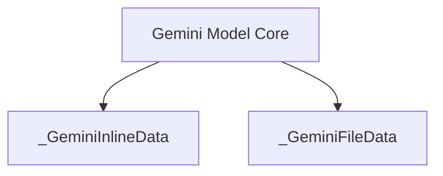

# Module: gemini_content_data_types

## Introduction
The `gemini_content_data_types` module defines the foundational Pydantic data structures used for representing inline and file-based content within the Gemini model integration. These data types are crucial for handling various forms of input and output content when interacting with the Gemini API, ensuring structured and validated data exchange.

## Architecture and Component Relationships

This module contains two core Pydantic models: `_GeminiInlineData` and `_GeminiFileData`. These models standardize the representation of data that can be sent to or received from Gemini models.

*   `_GeminiInlineData`: Represents content directly embedded as a string, typically used for text, JSON, or small binary data encoded in base64. It includes the data string itself and its MIME type.
*   `_GeminiFileData`: Represents content referenced by a URI, pointing to an external file. This is suitable for larger files or media content. It includes the file URI and its MIME type.

These data types are integral to the [gemini_data_structures](gemini_data_structures.md) module, which further orchestrates how different content parts are combined. They are also directly consumed by the [gemini_model_core](gemini_model_core.md) module for constructing requests and parsing responses from the Gemini API.

<!-- DIAGRAM_JSON
{
    "direction": "TD",
    "nodes": [
        {"id": "inline_data", "label": "_GeminiInlineData", "type": "component", "link": null},
        {"id": "file_data", "label": "_GeminiFileData", "type": "component", "link": null},
        {"id": "gemini_model_core_ext", "label": "Gemini Model Core", "type": "external", "link": "gemini_model_core.md"}
    ],
    "edges": [
        {"source": "gemini_model_core_ext", "target": "inline_data"},
        {"source": "gemini_model_core_ext", "target": "file_data"}
    ],
    "groups": []
}
-->

## How the Module Fits into the Overall System

The `gemini_content_data_types` module is a fundamental building block within the `pydantic_ai_models` ecosystem, specifically for the Gemini integration. It provides the low-level data definitions required for content handling.

It resides within the `gemini_data_structures` module, which itself is a child of `gemini_stream_data_types`, and ultimately part of the broader [gemini_model_integration](gemini_model_integration.md).

By defining these clear and validated data structures, this module ensures consistency and reliability when representing diverse content types (text, images, etc.) for interaction with Google's Gemini models. It abstracts away the complexities of content serialization and deserialization, allowing higher-level components like [gemini_model_core](gemini_model_core.md) to focus on model interaction logic.