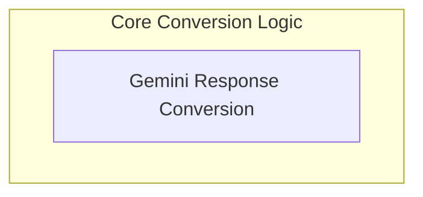

# Gemini Content Processing Module

This module is responsible for the crucial task of converting data between `pydantic-ai`'s internal `ModelResponse` format and the specific content structures required by the Gemini API. It acts as a bidirectional translator, ensuring seamless communication and data exchange with Gemini models.

## Architecture

The `gemini_content_processing` module primarily consists of a single, focused sub-module that manages the transformation of model responses and content. This sub-module is designed to abstract away the complexities of Gemini's content format, allowing the rest of the `pydantic-ai` system to interact with Gemini models using a consistent internal representation.

<!-- DIAGRAM_JSON
{
    "direction": "TD",
    "nodes": [
        {"id": "gemini_response_conversion", "label": "Gemini Response Conversion", "type": "module", "link": "gemini_response_conversion.md"}
    ],
    "edges": [],
    "groups": [
        {
            "id": "core_conversion",
            "label": "Core Conversion Logic",
            "role": "generative",
            "nodes": ["gemini_response_conversion"]
        }
    ]
}
-->

## Sub-modules

*   [Gemini Response Conversion](gemini_response_conversion.md): This sub-module handles the bi-directional conversion of content between `pydantic-ai`'s internal `ModelResponse` format and Gemini's native content structure.
