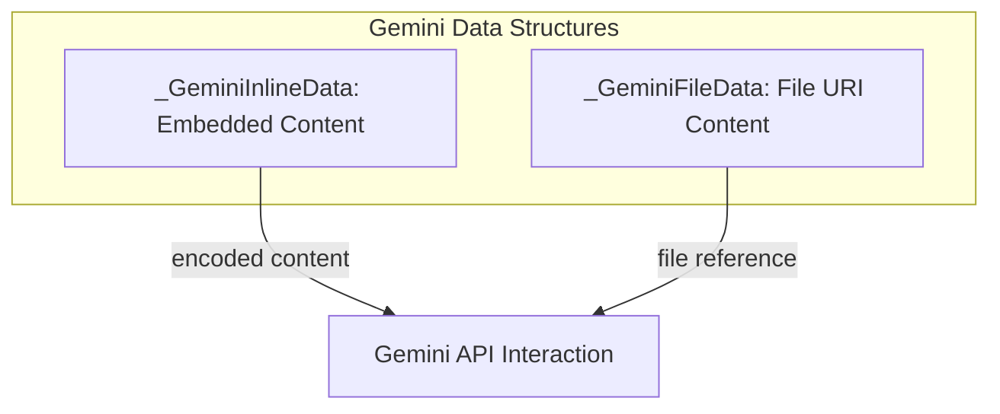

# Gemini Data Handling

## Introduction and Purpose

The `gemini_data_handling` module is responsible for defining the data structures used to represent various types of content, specifically inline data and file-based data, when interacting with Gemini models. This module provides a standardized way to encapsulate content for input to the Gemini API, ensuring that rich data can be seamlessly transmitted.

## Architecture Overview

This module consists of two primary data models: `_GeminiInlineData` and `_GeminiFileData`. These models serve as fundamental building blocks for constructing requests to the Gemini API, allowing for the inclusion of diverse content types directly within the request (inline) or by reference to a file URI.

- **`_GeminiInlineData`**: This class defines the structure for content that is embedded directly within the request. It includes the actual data as a string and its corresponding MIME type. This is suitable for smaller pieces of text, images (base64 encoded), or other media that can be sent without requiring an external file reference.

- **`_GeminiFileData`**: This class represents content that is referenced by a URI, typically for larger files or media that are hosted externally. It specifies the file's URI and its MIME type, allowing the Gemini model to access and process the content from the provided location.

These data structures are utilized by the [gemini_api_interaction.md](gemini_api_interaction.md) module to format requests and enable the Gemini model to consume varied input content effectively.

<!-- DIAGRAM_JSON
{
    "direction": "TD",
    "nodes": [
        {
            "id": "inline_data",
            "label": "Inline Data (_GeminiInlineData)",
            "type": "component"
        },
        {
            "id": "file_data",
            "label": "File Data (_GeminiFileData)",
            "type": "component"
        }
    ],
    "edges": [],
    "groups": [
        {
            "id": "gemini_data_structures",
            "label": "Gemini Data Structures",
            "role": "data",
            "nodes": [
                "inline_data",
                "file_data"
            ]
        }
    ]
}
-->
