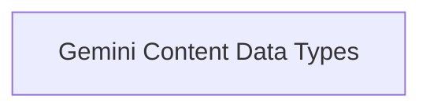

# Gemini Data Structures Module

The `gemini_data_structures` module is responsible for defining the fundamental data structures used to represent various types of content within Gemini model responses. Specifically, it provides classes for handling inline textual or binary data and references to external files, enabling flexible and comprehensive communication with Gemini models.

## Architecture Overview

The module's architecture is straightforward, focusing on providing clear and distinct data structures for different content types. It primarily consists of a single sub-module that encapsulates these definitions.

<!-- DIAGRAM_JSON
{
    "direction": "TD",
    "nodes": [
        {"id": "gemini_content_data_types", "label": "Gemini Content Data Types", "type": "module", "link": "gemini_content_data_types.md"}
    ],
    "edges": [],
    "groups": []
}
-->

## Sub-modules

### [Gemini Content Data Types](gemini_content_data_types.md)
This sub-module defines the data structures for handling inline and file-based content within Gemini model responses, such as `_GeminiInlineData` for direct data embedding and `_GeminiFileData` for referencing external files.