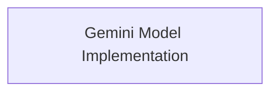

<!-- AUTO_GENERATED_PLACEHOLDER
  reason: LLM did not create .md file for this module
  module_path: pydantic_ai_agent_core/model_provider_gemini/gemini_api_interaction/gemini_model_interface/gemini_model
  component_count: 1
  generated_at: 2026-04-06T06:47:34.933642
  TODO: Fix LLM prompt to handle small leaf modules
-->

# Gemini Model Implementation

> ⚠️ **Auto-Generated Placeholder**
> This documentation was auto-generated because the LLM failed to create it.
> Module path: `pydantic_ai_agent_core/model_provider_gemini/gemini_api_interaction/gemini_model_interface/gemini_model`

Implements the GeminiModel for interacting with the Gemini API, handling requests, responses, and streaming.

## Components

This module contains 1 component(s):

- `pydantic_ai_slim.pydantic_ai.models.gemini.GeminiModel`

## Structure

---
*Auto-generated placeholder. See sync_issues.json for details.*
