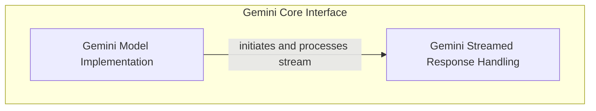

# Gemini Model Interface

The `gemini_model_interface` module provides the foundational components for seamless interaction with Google's Gemini large language models through their native API. It encapsulates the intricacies of API requests, response parsing, and streamed data handling, offering a streamlined and consistent interface for Gemini models within the `pydantic_ai_slim` framework.

## Architecture Overview

This module orchestrates the communication with the Gemini API. The `GeminiModel` component is responsible for initiating model requests and managing the overall interaction, while the `GeminiStreamedResponse` component specifically handles the processing and interpretation of responses when data is streamed from the API.

<!-- DIAGRAM_JSON
{
    "direction": "TD",
    "nodes": [
        {"id": "gemini_model", "label": "Gemini Model Implementation", "type": "module", "link": "gemini_model.md"},
        {"id": "gemini_streamed_response", "label": "Gemini Streamed Response Handling", "type": "module", "link": "gemini_streamed_response.md"}
    ],
    "edges": [
        {"source": "gemini_model", "target": "gemini_streamed_response", "label": "initiates and processes stream"}
    ],
    "groups": [
        {
            "id": "gemini_core_interface",
            "label": "Gemini Core Interface",
            "role": "generative",
            "nodes": ["gemini_model", "gemini_streamed_response"]
        }
    ]
}
-->

## Sub-modules

### [Gemini Model Implementation](gemini_model.md)
This sub-module provides the `GeminiModel` class, which is the primary interface for making requests to the Gemini API. It handles both synchronous and asynchronous requests, manages model settings, and processes the raw responses from the API into a usable format.

### [Gemini Streamed Response Handling](gemini_streamed_response.md)
This sub-module contains the `GeminiStreamedResponse` class, specifically designed to handle and process streamed responses from the Gemini API. It parses incoming data chunks, reconstructs the full response, and manages the lifecycle of the streamed interaction.