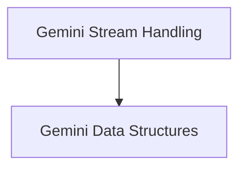

# Gemini Stream Data Types Module

## Introduction and Purpose

The `gemini_stream_data_types` module defines the essential data structures and handling mechanisms for processing streamed responses from the Gemini model. It plays a crucial role in enabling real-time interpretation of model outputs, including both textual content and function calls, as well as managing inline and file-based data within these streams. This module ensures that interactions with the Gemini model are robust, efficient, and well-structured, facilitating seamless integration with AI agents and applications.

## Architecture Overview

The `gemini_stream_data_types` module is composed of two primary sub-modules: `gemini_stream_handling` and `gemini_data_structures`. These sub-modules work in conjunction to provide a comprehensive framework for consuming and interpreting Gemini's streaming output.

<!-- DIAGRAM_JSON
{
    "direction": "TD",
    "nodes": [
        {"id": "gemini_stream_handling", "label": "Gemini Stream Handling", "type": "module", "link": "gemini_stream_handling.md"},
        {"id": "gemini_data_structures", "label": "Gemini Data Structures", "type": "module", "link": "gemini_data_structures.md"}
    ],
    "edges": [
        {"source": "gemini_stream_handling", "target": "gemini_data_structures"}
    ],
    "groups": []
}
-->

## Sub-modules

### Gemini Stream Handling
This sub-module, documented in [gemini_stream_handling.md](gemini_stream_handling.md), is responsible for the core logic of processing streaming responses from the Gemini model. It handles the asynchronous iteration over response chunks, manages partial responses, and extracts meaningful events such as text deltas and function calls.

### Gemini Data Structures
The [gemini_data_structures.md](gemini_data_structures.md) sub-module defines the Pydantic models used to represent various data types within Gemini model responses. This includes structures for inline data and references to file-based data, ensuring type-safe and consistent handling of different content formats.
