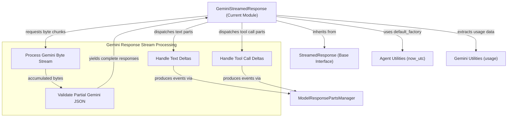

# Gemini Streamed Response Module

The `gemini_streamed_response` module provides the core functionality for handling streamed responses from the Gemini large language model. It defines the `GeminiStreamedResponse` class, which is responsible for parsing raw byte streams from the Gemini API and converting them into a structured sequence of model response events, including text deltas and tool calls.

This module is critical for applications that require real-time processing of Gemini's generative output, enabling dynamic updates as the model produces its response. It abstracts away the complexities of handling partial JSON responses and efficiently manages the state of the streamed content.

## Components

### GeminiStreamedResponse

The `GeminiStreamedResponse` class extends the `StreamedResponse` interface to specifically manage responses from the Gemini model. It takes a raw byte stream and iteratively processes it to extract meaningful events.

**Key responsibilities:**
- **Stream Processing**: Consumes an asynchronous byte stream directly from the Gemini API.
- **Partial Response Handling**: Accumulates incoming byte chunks and uses partial JSON parsing to identify and process complete Gemini responses as they arrive.
- **Event Generation**: Transforms parsed Gemini parts (text, function calls) into standardized `ModelResponseStreamEvent` objects.
- **Tool Call Management**: Assigns unique IDs to tool calls for tracking, assuming they arrive as complete units.
- **Usage Reporting**: Extracts and stores model usage metadata upon completion of the stream.

**Core Methods:**

- `_get_event_iterator()`: This asynchronous generator is the primary entry point for consumers to receive `ModelResponseStreamEvent`s. It iterates through parsed Gemini responses and dispatches text and tool call deltas to the `_parts_manager`.
- `_get_gemini_responses()`: This internal asynchronous generator handles the raw byte stream. It continuously appends new chunks, attempts to validate and parse the accumulated content as JSON, and yields complete Gemini responses. It is designed to gracefully handle partial JSON objects within the stream.

## Architecture

<!-- DIAGRAM_JSON
{
    "direction": "TD",
    "nodes": [
        {"id": "gemini_streamed_response", "label": "GeminiStreamedResponse (Current Module)", "type": "component", "link": null},
        {"id": "process_gemini_stream", "label": "Process Gemini Byte Stream", "type": "component", "link": null},
        {"id": "validate_gemini_json", "label": "Validate Partial Gemini JSON", "type": "component", "link": null},
        {"id": "handle_text_deltas", "label": "Handle Text Deltas", "type": "component", "link": null},
        {"id": "handle_tool_call_deltas", "label": "Handle Tool Call Deltas", "type": "component", "link": null},
        {"id": "streamed_response_base", "label": "StreamedResponse (Base Interface)", "type": "external", "link": "model_core_interfaces.md"},
        {"id": "parts_manager", "label": "ModelResponsePartsManager", "type": "external", "link": "agent_output_handling.md"},
        {"id": "agent_utilities", "label": "Agent Utilities (now_utc)", "type": "external", "link": "agent_utilities.md"},
        {"id": "gemini_usage_util", "label": "Gemini Utilities (usage)", "type": "external", "link": "gemini_utility_components.md"}
    ],
    "edges": [
        {"source": "gemini_streamed_response", "target": "streamed_response_base", "label": "inherits from"},
        {"source": "gemini_streamed_response", "target": "agent_utilities", "label": "uses default_factory"},
        {"source": "gemini_streamed_response", "target": "process_gemini_stream", "label": "requests byte chunks"},
        {"source": "process_gemini_stream", "target": "validate_gemini_json", "label": "accumulated bytes"},
        {"source": "validate_gemini_json", "target": "gemini_streamed_response", "label": "yields complete responses"},
        {"source": "gemini_streamed_response", "target": "handle_text_deltas", "label": "dispatches text parts"},
        {"source": "gemini_streamed_response", "target": "handle_tool_call_deltas", "label": "dispatches tool call parts"},
        {"source": "handle_text_deltas", "target": "parts_manager", "label": "produces events via"},
        {"source": "handle_tool_call_deltas", "target": "parts_manager", "label": "produces events via"},
        {"source": "gemini_streamed_response", "target": "gemini_usage_util", "label": "extracts usage data"}
    ],
    "groups": [
        {
            "id": "gemini_response_processing",
            "label": "Gemini Response Stream Processing",
            "role": "analytical",
            "nodes": ["process_gemini_stream", "validate_gemini_json", "handle_text_deltas", "handle_tool_call_deltas"]
        }
    ]
}
-->
