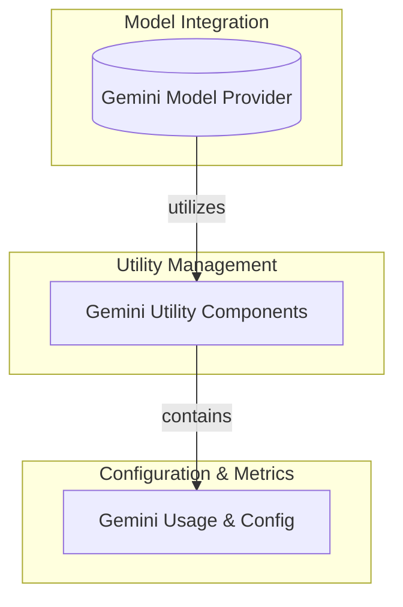

# Gemini Usage and Configuration

## Introduction
The `gemini_usage_and_config` module is a critical component within the larger `pydantic_ai_slim` framework, specifically designed to handle interactions with Google's Gemini models. Its primary functions involve processing API response metadata to accurately report model usage and configuring tool-calling capabilities for Gemini models. This module ensures that usage metrics are properly captured and that the model can effectively utilize predefined tools during its operation.

## Architecture Overview

<!-- DIAGRAM_JSON
{
    "direction": "TD",
    "nodes": [
        {
            "id": "model_provider_gemini",
            "label": "Gemini Model Provider",
            "type": "module",
            "link": "model_provider_gemini.md"
        },
        {
            "id": "gemini_utility_components",
            "label": "Gemini Utility Components",
            "type": "module",
            "link": "gemini_utility_components.md"
        },
        {
            "id": "gemini_usage_and_config",
            "label": "Gemini Usage & Config",
            "type": "module",
            "link": "gemini_usage_and_config.md"
        }
    ],
    "edges": [
        {
            "source": "model_provider_gemini",
            "target": "gemini_utility_components",
            "label": "utilizes"
        },
        {
            "source": "gemini_utility_components",
            "target": "gemini_usage_and_config",
            "label": "contains"
        }
    ],
    "groups": [
        {
            "id": "model_integration",
            "label": "Model Integration",
            "role": "generative",
            "nodes": [
                "model_provider_gemini"
            ]
        },
        {
            "id": "utility_management",
            "label": "Utility Management",
            "role": "analytical",
            "nodes": [
                "gemini_utility_components"
            ]
        },
        {
            "id": "configuration_and_metrics",
            "label": "Configuration & Metrics",
            "role": "data",
            "nodes": [
                "gemini_usage_and_config"
            ]
        }
    ]
}
-->

## Functionality

### _metadata_as_usage
The `_metadata_as_usage` component is responsible for parsing the `usage_metadata` field from a Gemini API response and converting it into a structured `RequestUsage` object. This function aggregates various token counts, including prompt tokens, candidate tokens, cached content tokens, thoughts tokens, and tool-use prompt tokens. It also specifically handles modality-specific token counts such as input and output audio tokens, providing a comprehensive overview of the model's resource consumption. This is crucial for cost tracking, performance analysis, and understanding how different parts of the model interaction contribute to overall usage.

### _tool_config
The `_tool_config` component generates a `_GeminiToolConfig` object, which is used to define the tool-calling behavior of the Gemini model. By taking a list of function names, it configures the model to operate in `'ANY'` function-calling mode, allowing it to select and invoke any of the specified functions based on the user's prompt and its internal reasoning. This component is fundamental for enabling Gemini models to interact with external tools and services, extending their capabilities beyond simple text generation to perform actions in the real world.