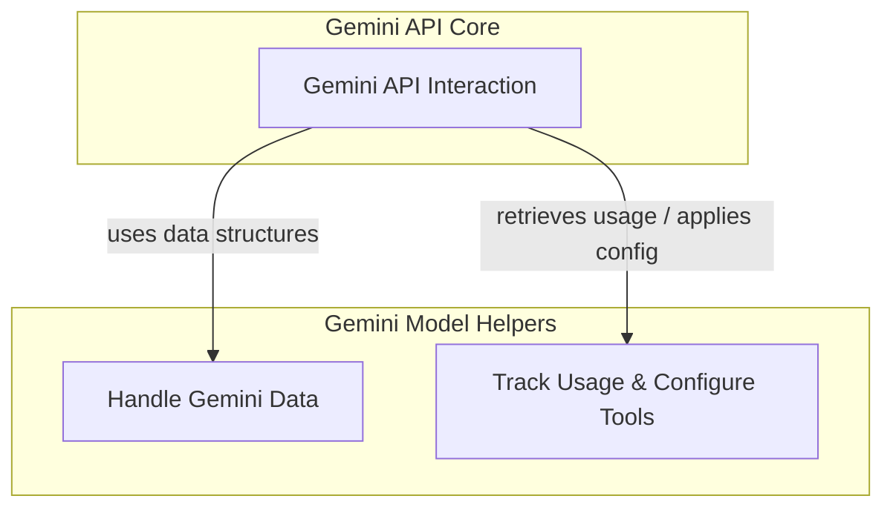

# Gemini Utility Components

The `gemini_utility_components` module provides essential helper functionalities for interacting with the Gemini large language models. It encapsulates core utilities related to handling model metadata, configuring tool usage, and structuring data for API requests. This module ensures seamless integration and efficient communication with the Gemini API, supporting various aspects of model interaction from data serialization to usage tracking.

## Architecture Overview

The `gemini_utility_components` module supports the broader [model_provider_gemini](model_provider_gemini.md) module by providing foundational components for data formatting, tool configuration, and response metadata processing. It acts as a set of specialized helpers that the main Gemini model interface uses to construct requests and interpret responses effectively.

<!-- DIAGRAM_JSON
{
    "direction": "TD",
    "nodes": [
        {
            "id": "gemini_utility_components",
            "label": "Gemini Utility Components",
            "type": "module"
        },
        {
            "id": "gemini_api_interaction",
            "label": "Gemini API Interaction",
            "type": "external",
            "link": "gemini_api_interaction.md"
        },
        {
            "id": "gemini_data_handling",
            "label": "Handle Gemini Data",
            "type": "module",
            "link": "gemini_data_handling.md"
        },
        {
            "id": "gemini_usage_and_config",
            "label": "Track Usage & Configure Tools",
            "type": "module",
            "link": "gemini_usage_and_config.md"
        }
    ],
    "edges": [
        {
            "source": "gemini_api_interaction",
            "target": "gemini_data_handling",
            "label": "uses data structures"
        },
        {
            "source": "gemini_api_interaction",
            "target": "gemini_usage_and_config",
            "label": "retrieves usage / applies config"
        }
    ],
    "groups": [
        {
            "id": "gemini_model_helpers",
            "label": "Gemini Model Helpers",
            "role": "data",
            "nodes": [
                "gemini_data_handling",
                "gemini_usage_and_config"
            ]
        },
        {
            "id": "api_core",
            "label": "Gemini API Core",
            "role": "surface",
            "nodes": [
                "gemini_api_interaction"
            ]
        }
    ]
}
-->

## Sub-modules

This module is composed of the following sub-modules:

### [Gemini Data Handling](gemini_data_handling.md)
This sub-module defines Pydantic models for representing inline and file-based data in Gemini API requests and responses, facilitating structured communication with the model.

### [Gemini Usage & Configuration](gemini_usage_and_config.md)
This sub-module focuses on extracting usage metadata from Gemini model responses and configuring tools for function calling, providing insights into model consumption and enabling dynamic tool integration.
