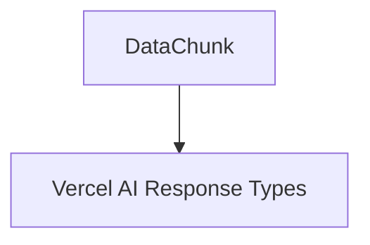

# generic_data_chunk

## Introduction

The `generic_data_chunk` module is a crucial component within the `pydantic_ai_ui` system, specifically designed to handle the transmission of arbitrary, dynamically typed data chunks within the Vercel AI UI's response stream. Its core functionality revolves around the `DataChunk` class, which serves as a flexible container for various data types, enabling rich and interactive user experiences in AI applications.

## Architecture and Component Relationships

The `generic_data_chunk` module primarily consists of the `DataChunk` class. This class inherits from `BaseChunk` (a component of the `vercel_ai_response_types` module), establishing a common interface for all response chunks within the Vercel AI UI.

### Core Component: `DataChunk`

-   **`DataChunk`**: This class is a Pydantic model representing a generic data segment. It includes:
    -   `type`: An annotated string field that must conform to the pattern `^data-`, allowing for dynamic classification of the data chunk.
    -   `id`: An optional string identifier for the chunk.
    -   `data`: An `Any` type field to hold the actual payload, making it highly versatile for different data structures.
    -   `transient`: An optional boolean indicating if the chunk is transient.

The `DataChunk` class provides the foundational structure for sending non-standard, application-specific data to the UI, ensuring that the frontend can interpret and render diverse information streams.

<!-- DIAGRAM_JSON
{
    "direction": "TD",
    "nodes": [
        {"id": "data_chunk", "label": "DataChunk", "type": "component", "link": null},
        {"id": "vercel_ai_response_types", "label": "Vercel AI Response Types", "type": "external", "link": "vercel_ai_response_types.md"}
    ],
    "edges": [
        {"source": "data_chunk", "target": "vercel_ai_response_types"}
    ],
    "groups": []
}
-->

## System Integration

The `generic_data_chunk` module, through its `DataChunk` component, plays a vital role in the `pydantic_ai_ui`'s ability to communicate complex and dynamic information to the user interface. It is a fundamental part of the [vercel_ai_response_types](vercel_ai_response_types.md) module, which defines the complete set of response structures for the Vercel AI frontend.

This module enables scenarios where the AI agent needs to convey structured data that doesn't fit into standard text messages or predefined response types. Examples include:
-   Sending progress updates or intermediate results.
-   Transmitting custom UI components or interaction prompts.
-   Delivering metadata or auxiliary information related to the ongoing conversation or task.

By providing a flexible `DataChunk`, the `pydantic_ai_ui` can maintain a rich and interactive communication channel with the frontend, supporting advanced AI agent behaviors and user experiences. It integrates with the broader [pydantic_ai_ui](pydantic_ai_ui.md) system by being a foundational data structure passed through the UI's event stream.
