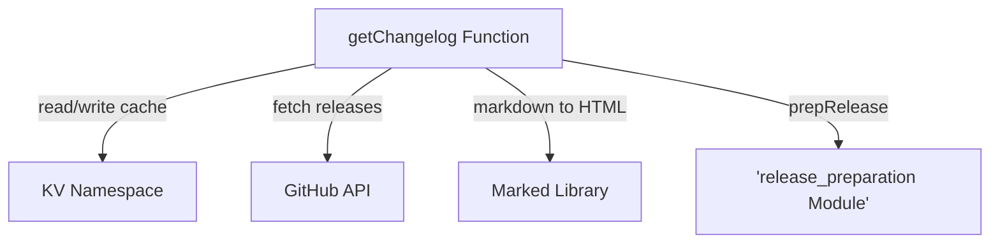

# get_changelog Module Documentation

## Introduction

The `get_changelog` module is responsible for retrieving, processing, and caching the changelog for the `pydantic-ai` project. It fetches release information from the GitHub API, converts it into an HTML format, and stores it in a KV store for efficient retrieval.

## Core Functionality

The primary function within this module is `getChangelog`, which orchestrates the entire process of changelog generation and caching.

### `getChangelog` Function

```typescript
async function getChangelog(kv: KVNamespace, commitSha: string): Promise<string>
```

**Purpose**: This asynchronous function fetches the latest releases from the `pydantic/pydantic-ai` GitHub repository, processes their content, and returns a consolidated HTML changelog. It integrates caching mechanisms to reduce redundant API calls and improve performance.

**Parameters**:
*   `kv`: A `KVNamespace` instance used for caching the generated changelog. This prevents repeated fetches from GitHub.
*   `commitSha`: A string representing a commit SHA, used as part of the cache key. While not directly used to filter GitHub releases, it ensures cache invalidation if the underlying code changes.

**Process Overview**:
1.  **Cache Check**: It first attempts to retrieve the changelog from the `kv` cache using a key derived from the `commitSha`. If a cached version is found and is still valid (based on `cacheTtl`), it is immediately returned.
2.  **GitHub API Fetch**: If no valid cached entry is found, the function proceeds to fetch release data from the GitHub Releases API (`https://api.github.com/repos/pydantic/pydantic-ai/releases`). It handles pagination by following `Link` headers to retrieve all available releases.
3.  **Error Handling**: Robust error checking is performed during the API fetch, throwing an error if the response is not `ok`.
4.  **Content Transformation**: Each fetched release object is processed by the `prepRelease` function (from the [release_preparation](release_preparation.md) module) to format its content. The processed releases are then joined and converted from Markdown to HTML using the `marked` library.
5.  **Cache Storage**: The newly generated HTML changelog is stored in the `kv` cache with an `expirationTtl` to ensure its freshness.
6.  **Return Value**: The function returns the final HTML string representing the changelog.

## Architecture and Component Relationships

The `get_changelog` module, through its `getChangelog` function, acts as a central point for changelog generation within the documentation site. It interacts with several external services and internal components.

<!-- DIAGRAM_JSON
{
    "direction": "TD",
    "nodes": [
        {"id": "get_changelog_function", "label": "getChangelog Function", "type": "component", "link": null},
        {"id": "kv_namespace", "label": "KV Namespace", "type": "external", "link": null},
        {"id": "github_api", "label": "GitHub API", "type": "external", "link": null},
        {"id": "marked_library", "label": "Marked Library", "type": "external", "link": null},
        {"id": "release_preparation", "label": "release_preparation Module", "type": "external", "link": "release_preparation.md"}
    ],
    "edges": [
        {"source": "get_changelog_function", "target": "kv_namespace", "label": "read/write cache"},
        {"source": "get_changelog_function", "target": "github_api", "label": "fetch releases"},
        {"source": "get_changelog_function", "target": "marked_library", "label": "markdown to HTML"},
        {"source": "get_changelog_function", "target": "release_preparation", "label": "prepRelease"}
    ],
    "groups": []
}
-->



## Integration with the Overall System

The `get_changelog` module is a leaf module within the `docs_site_utils` ecosystem, specifically nested under `changelog_management`.

*   **Parent Module**: [changelog_management](changelog_management.md) - This module groups functionalities related to managing and preparing changelog content.
*   **Sibling Module**: [release_preparation](release_preparation.md) - This module provides the `prepRelease` function, which is critical for formatting individual release entries before they are combined into the full changelog HTML.
*   **Role**: It provides the core logic for fetching and rendering the project's changelog, making the release history accessible and readable on the documentation site. It's a key part of how the documentation site dynamically presents up-to-date release information to users.
