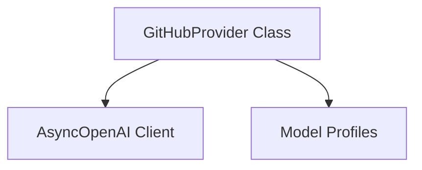

# `github_provider` Module Documentation

The `github_provider` module provides an interface for interacting with the GitHub Models API, enabling seamless integration of various AI models hosted by GitHub into applications built with `pydantic_ai_slim`. This module specifically offers an OpenAI-compatible API experience, allowing developers to leverage GitHub's AI offerings using familiar client structures.

### Purpose and Core Functionality

The primary purpose of the `github_provider` module is to act as a `Provider` for the GitHub Models API. It abstracts the underlying API interactions, allowing applications to communicate with GitHub-hosted AI models as if they were standard OpenAI-compatible services.

The core functionality is encapsulated within the `GitHubProvider` class:

*   **GitHubProvider Class (`pydantic_ai_slim.pydantic_ai.providers.github.GitHubProvider`)**: This class inherits from `Provider[AsyncOpenAI]` and facilitates connections to the GitHub Models API. It configures the `AsyncOpenAI` client with the appropriate base URL and API key.
    *   **Authentication**: It handles authentication using a GitHub token, which can be provided directly or through the `GITHUB_API_KEY` environment variable.
    *   **Client Management**: It manages the `AsyncOpenAI` client instance, either by creating a new one or utilizing an existing client provided during initialization.
    *   **Model Profiling**: It includes a `model_profile` static method that maps various model names (potentially prefixed with their original providers like `xai`, `meta`, `microsoft`, `mistral-ai`, `cohere`, `deepseek`) to the corresponding `ModelProfile` instances, ensuring proper configuration, including the use of `OpenAIJsonSchemaTransformer`. This allows for flexible handling of different models available through the GitHub API.

### Architecture and Component Relationships

The `github_provider` module is a leaf module within the `openai_compatible_providers` hierarchy. Its main component, `GitHubProvider`, primarily interacts with the `AsyncOpenAI` client (an external library) for making API calls and utilizes `ModelProfile` utilities from the `pydantic_ai_providers` module to configure model-specific behaviors.

<!-- DIAGRAM_JSON
{
    "direction": "TD",
    "nodes": [
        {"id": "github_provider_class", "label": "GitHubProvider Class", "type": "component", "link": null},
        {"id": "openai_client", "label": "AsyncOpenAI Client", "type": "external", "link": null},
        {"id": "model_profiles", "label": "Model Profiles", "type": "external", "link": "pydantic_ai_providers.md#model-profiles"}
    ],
    "edges": [
        {"source": "github_provider_class", "target": "openai_client"},
        {"source": "github_provider_class", "target": "model_profiles"}
    ],
    "groups": []
}
-->

**Relationships:**

*   **`GitHubProvider Class`** is the central component of this module.
*   It instantiates and uses an **`AsyncOpenAI Client`** (an external library) to communicate with the GitHub Models API.
*   It consults **`Model Profiles`** (from the [pydantic_ai_providers](pydantic_ai_providers.md#model-profiles) module) to retrieve specific configurations for different AI models hosted on GitHub, ensuring compatibility and correct schema transformations.

### How the Module Fits into the Overall System

The `github_provider` module is an integral part of the `pydantic_ai_providers` ecosystem, specifically categorized under [openai_compatible_providers](pydantic_ai_providers.md#openai-compatible-providers). Its placement signifies its role in extending the `pydantic_ai_slim` framework's capability to interact with various AI model providers that adhere to the OpenAI API standard.

By providing a specialized `Provider` implementation for GitHub Models, this module allows developers to:
1.  **Uniformly Access GitHub Models**: Treat GitHub's AI models like any other OpenAI-compatible service within the `pydantic_ai_slim` framework.
2.  **Abstract API Specifics**: Developers don't need to write custom code for GitHub's API; the `GitHubProvider` handles the base URL, authentication, and client configuration.
3.  **Leverage Existing Tooling**: Utilize the robust model profiling and output processing capabilities already present in `pydantic_ai_slim` with GitHub-hosted models.

This integration enriches the `pydantic_ai_slim` library by expanding the range of readily available AI model providers, offering more flexibility and choice to users.