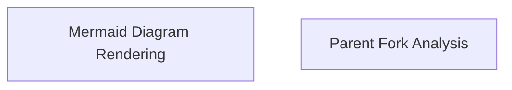

# Graph Analysis and Rendering Module

The `graph_analysis_and_rendering` module, part of the `pydantic_graph_beta` package, is dedicated to both structural analysis of graph flows and the visual representation of these graphs using Mermaid diagrams. It provides essential tools for developers and maintainers to understand and debug complex graph execution paths.

## Architecture Overview

This module is composed of two primary sub-modules, each addressing a distinct but related aspect of graph management:

<!-- DIAGRAM_JSON
{
    "direction": "TD",
    "nodes": [
        {"id": "mermaid_rendering", "label": "Mermaid Diagram Rendering", "type": "module", "link": "mermaid_rendering.md"},
        {"id": "fork_analysis", "label": "Parent Fork Analysis", "type": "module", "link": "fork_analysis.md"}
    ],
    "edges": [],
    "groups": []
}
-->

## High-Level Functionality

*   **[Mermaid Diagram Rendering](mermaid_rendering.md)**: This sub-module focuses on converting internal graph representations into Mermaid state diagram syntax, enabling clear visual representation of graph flows. It includes utilities for collecting edges and rendering the full diagram.

*   **[Parent Fork Analysis](fork_analysis.md)**: This sub-module provides sophisticated algorithms to identify and manage "parent forks" for join nodes within the graph. This analysis is critical for coordinating parallel execution paths and ensuring deadlock prevention in complex graph scenarios.