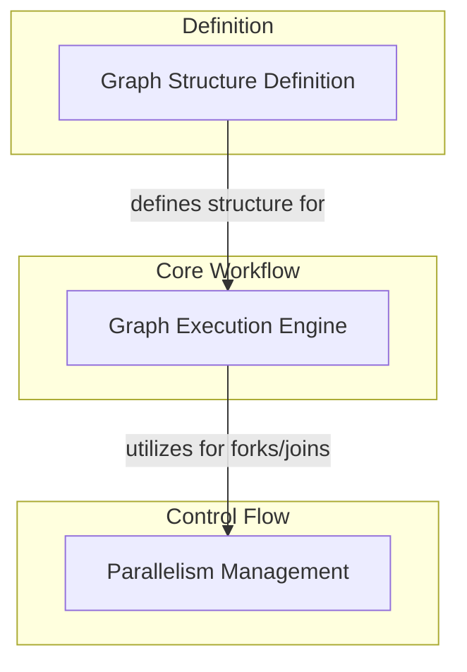

# Graph Beta Features Module

## Introduction and Purpose

The `graph_beta_features` module provides experimental features for building and executing Pydantic-based directed acyclic graphs (DAGs). These graphs enable complex workflow definitions with typed inputs, outputs, state, and dependencies, supporting parallel execution, dynamic pathing, and robust error handling. This module is crucial for defining and running sophisticated agent behaviors and data processing pipelines within the system, offering a flexible and powerful way to orchestrate intricate logic.

## Architecture Overview

The module is structured into three primary sub-modules, each handling a distinct aspect of graph definition and execution:

1.  **[Graph Execution Engine](graph_execution_engine.md)**: Manages the core logic for running graph workflows, including task scheduling, state management, and iteration over graph steps.
2.  **[Parallelism Management](parallelism_management.md)**: Focuses on coordinating parallel execution paths, specifically handling join operations and identifying parent forks to ensure proper synchronization.
3.  **[Graph Structure Definition](graph_structure_definition.md)**: Provides the foundational elements for constructing graphs, such as defining individual steps and building execution paths.

These sub-modules work in concert to allow users to define a graph structure and then execute it, handling the complexities of parallel processing and state transitions.

<!-- DIAGRAM_JSON
{
    "direction": "TD",
    "nodes": [
        {"id": "graph_execution_engine", "label": "Graph Execution Engine", "type": "module", "link": "graph_execution_engine.md"},
        {"id": "parallelism_management", "label": "Parallelism Management", "type": "module", "link": "parallelism_management.md"},
        {"id": "graph_structure_definition", "label": "Graph Structure Definition", "type": "module", "link": "graph_structure_definition.md"}
    ],
    "edges": [
        {"source": "graph_structure_definition", "target": "graph_execution_engine", "label": "defines structure for"},
        {"source": "graph_execution_engine", "target": "parallelism_management", "label": "utilizes for forks/joins"}
    ],
    "groups": [
        {
            "id": "core_workflow",
            "label": "Core Workflow",
            "role": "generative",
            "nodes": ["graph_execution_engine"]
        },
        {
            "id": "control_flow",
            "label": "Control Flow",
            "role": "analytical",
            "nodes": ["parallelism_management"]
        },
        {
            "id": "definition",
            "label": "Definition",
            "role": "data",
            "nodes": ["graph_structure_definition"]
        }
    ]
}
-->

