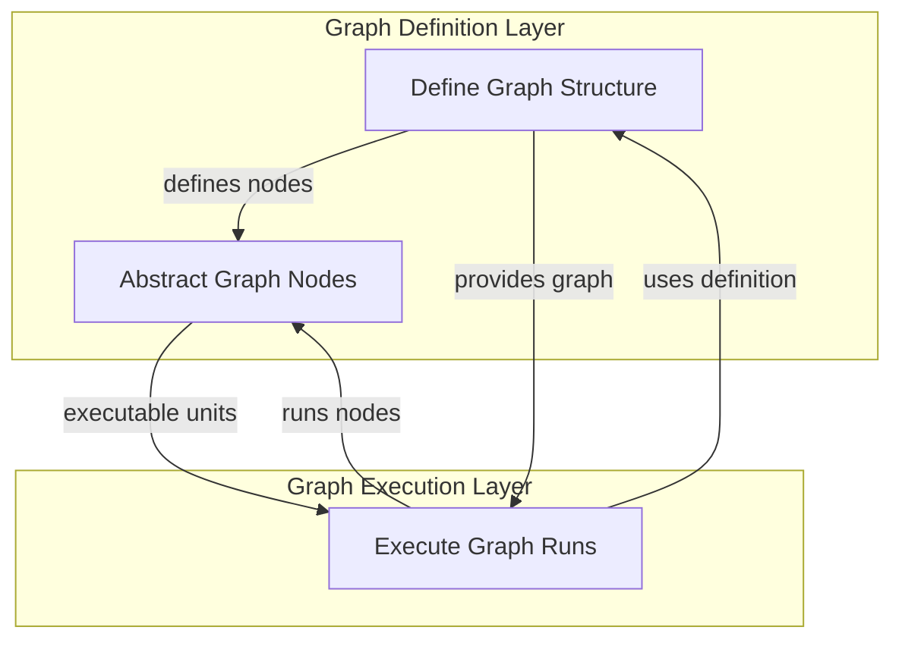

# Graph Core Execution Module

The `graph_core_execution` module provides the fundamental framework for defining, executing, and managing directed graphs within the system. It enables the creation of complex workflows by connecting individual processing units (nodes) in a structured manner, facilitating both synchronous and asynchronous execution, state management, and clear result handling. This module is critical for building agentic behaviors and automated processes that require sequential or branching logic.

## Architecture Overview

The `graph_core_execution` module is composed of three primary sub-modules that work in concert to provide a robust graph execution environment:

*   **[Graph Definition](graph_definition.md)**: This sub-module is responsible for the foundational definition of a graph, allowing users to specify nodes and their connections. It handles the structural integrity and setup of the graph.
*   **[Node Abstraction](node_abstraction.md)**: This sub-module provides the abstract interface for all executable components within the graph. It dictates the contract for how individual processing steps are defined and executed.
*   **[Graph Runtime Execution](graph_runtime.md)**: This sub-module manages the actual execution of a defined graph, handling state transitions, node sequencing, and capturing the overall run results.

These components collectively ensure that graphs can be easily defined, validated, executed, and their progress observed and persisted.

<!-- DIAGRAM_JSON
{
    "direction": "TD",
    "nodes": [
        {"id": "graph_definition", "label": "Define Graph Structure", "type": "module", "link": "graph_definition.md"},
        {"id": "node_abstraction", "label": "Abstract Graph Nodes", "type": "module", "link": "node_abstraction.md"},
        {"id": "graph_runtime", "label": "Execute Graph Runs", "type": "module", "link": "graph_runtime.md"}
    ],
    "edges": [
        {"source": "graph_definition", "target": "node_abstraction", "label": "defines nodes"},
        {"source": "graph_definition", "target": "graph_runtime", "label": "provides graph"},
        {"source": "node_abstraction", "target": "graph_runtime", "label": "executable units"},
        {"source": "graph_runtime", "target": "graph_definition", "label": "uses definition"},
        {"source": "graph_runtime", "target": "node_abstraction", "label": "runs nodes"}
    ],
    "groups": [
        {
            "id": "definition_layer",
            "label": "Graph Definition Layer",
            "role": "generative",
            "nodes": ["graph_definition", "node_abstraction"]
        },
        {
            "id": "execution_layer",
            "label": "Graph Execution Layer",
            "role": "surface",
            "nodes": ["graph_runtime"]
        }
    ]
}
-->
```
