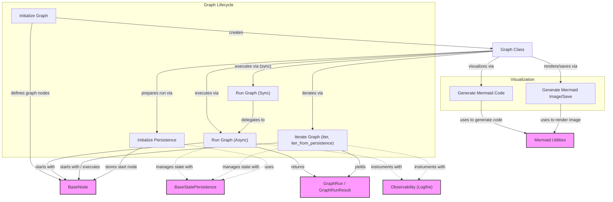

# Graph Definition Module

The `graph_definition` module, centered around the `Graph` class, is the core component for defining and orchestrating directed graphs within the `pydantic-graph` framework. It provides the mechanisms to structure complex workflows as a series of interconnected nodes, manage their execution, and visualize their structure.

This module is fundamental for building agent behaviors, data processing pipelines, or any system that benefits from a clear, sequential, or branching execution flow based on a defined state and dependencies.

## Key Features

*   **Node-based Graph Construction**: Define graphs by providing a sequence of `BaseNode` instances, where each node encapsulates a specific unit of work.
*   **Edge Validation**: Automatically validates the connections between nodes to ensure a coherent graph structure, preventing references to undefined nodes.
*   **Flexible Execution**: Supports both synchronous and asynchronous execution patterns, allowing integration into various application environments.
*   **Iterative Execution Control**: Provides an advanced API (`iter`) for fine-grained control over graph execution, enabling monitoring, pausing, and resuming of workflows.
*   **State Persistence Integration**: Seamlessly integrates with state persistence mechanisms (`BaseStatePersistence`) to save and restore graph execution progress.
*   **Visual Diagram Generation**: Generates Mermaid diagrams to visually represent the graph's architecture, aiding in understanding and debugging.
*   **Auto-instrumentation**: Integrates with observability tools (like Logfire) to automatically instrument graph runs and node executions, providing insights into performance and flow.

## How it Works

The `Graph` class acts as a blueprint for an executable workflow. When initialized, it takes a collection of `BaseNode` types. Each `BaseNode` defines its logic (via the `run` method) and specifies which other nodes it can transition to (its outgoing edges).

During execution, the `Graph` traverses these nodes, managing the shared `StateT` object and injecting `DepsT` dependencies into each node's `run` method. The execution continues until a node returns an `End` signal, indicating the graph's completion. The `iter` method offers a powerful way to observe and control this traversal step-by-step.

For visualization, the `Graph` can generate Mermaid syntax, allowing developers to render clear diagrams of their workflows.

## Architecture Diagram

<!-- DIAGRAM_JSON
{
    "direction": "TD",
    "nodes": [
        {"id": "graph_class", "label": "Graph Class", "type": "component", "link": null},
        {"id": "init_graph", "label": "Initialize Graph", "type": "component", "link": null},
        {"id": "run_async", "label": "Run Graph (Async)", "type": "component", "link": null},
        {"id": "run_sync", "label": "Run Graph (Sync)", "type": "component", "link": null},
        {"id": "iterate_graph", "label": "Iterate Graph", "type": "component", "link": null},
        {"id": "initialize_persistence", "label": "Initialize Persistence", "type": "component", "link": null},
        {"id": "generate_mermaid_code", "label": "Generate Mermaid Code", "type": "component", "link": null},
        {"id": "generate_mermaid_image", "label": "Generate Mermaid Image/Save", "type": "component", "link": null},
        {"id": "base_node", "label": "BaseNode", "type": "external", "link": "node_abstraction.md"},
        {"id": "graph_run", "label": "GraphRun / GraphRunResult", "type": "external", "link": "graph_runtime.md"},
        {"id": "state_persistence", "label": "BaseStatePersistence", "type": "external", "link": "graph_persistence.md"},
        {"id": "mermaid_utils", "label": "Mermaid Utilities", "type": "external", "link": "graph_visualization.md"},
        {"id": "observability", "label": "Observability (Logfire)", "type": "external", "link": "async_execution_primitives.md"}
    ],
    "edges": [
        {"source": "init_graph", "target": "graph_class", "label": "creates"},
        {"source": "init_graph", "target": "base_node", "label": "defines graph nodes"},
        {"source": "graph_class", "target": "run_async", "label": "executes via"},
        {"source": "graph_class", "target": "run_sync", "label": "executes via (sync)"},
        {"source": "graph_class", "target": "iterate_graph", "label": "iterates via"},
        {"source": "graph_class", "target": "initialize_persistence", "label": "prepares run via"},
        {"source": "graph_class", "target": "generate_mermaid_code", "label": "visualizes via"},
        {"source": "graph_class", "target": "generate_mermaid_image", "label": "renders/saves via"},
        {"source": "run_async", "target": "base_node", "label": "starts with"},
        {"source": "run_async", "target": "state_persistence", "label": "manages state with"},
        {"source": "run_async", "target": "graph_run", "label": "returns"},
        {"source": "run_async", "target": "observability", "label": "instruments with"},
        {"source": "run_sync", "target": "run_async", "label": "delegates to"},
        {"source": "iterate_graph", "target": "base_node", "label": "starts with / executes"},
        {"source": "iterate_graph", "target": "state_persistence", "label": "manages state with"},
        {"source": "iterate_graph", "target": "graph_run", "label": "yields"},
        {"source": "iterate_graph", "target": "observability", "label": "instruments with"},
        {"source": "initialize_persistence", "target": "base_node", "label": "stores start node"},
        {"source": "initialize_persistence", "target": "state_persistence", "label": "uses"},
        {"source": "generate_mermaid_code", "target": "mermaid_utils", "label": "uses to generate code"},
        {"source": "generate_mermaid_image", "target": "mermaid_utils", "label": "uses to render image"}
    ],
    "groups": []
}
-->
