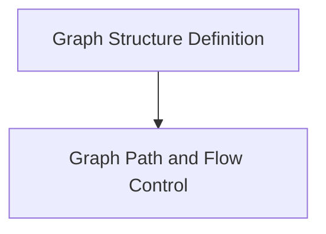

# Graph Definition Module


## Architecture Overview

The `graph_definition` module is composed of several key sub-modules that work together to provide a robust framework for graph construction.

<!-- DIAGRAM_JSON
{
    "direction": "TD",
    "nodes": [
        {"id": "graph_structure_definition", "label": "Graph Structure Definition", "type": "module", "link": "graph_structure_definition.md"},
        {"id": "graph_path_and_flow", "label": "Graph Path and Flow Control", "type": "module", "link": "graph_path_and_flow.md"}
    ],
    "edges": [
        {"source": "graph_structure_definition", "target": "graph_path_and_flow"}
    ],
    "groups": []
}
-->



## Sub-modules

### Graph Structure Definition
This sub-module contains the foundational elements for defining the overall graph structure and its atomic execution units. It includes the `Graph` class, which encapsulates the entire workflow, and the `Step` class, which represents individual operations within the graph.
*   [View `graph_structure_definition` documentation](graph_structure_definition.md)

### Graph Path and Flow Control
This sub-module focuses on controlling the flow of data and execution paths within the graph. It provides mechanisms for building complex sequences of operations, handling parallel execution with forks, and synchronizing these paths using join operations.
*   [View `graph_path_and_flow` documentation](graph_path_and_flow.md)


This module defines the core `Graph` class, which serves as the fundamental building block for creating and executing directed graphs of operations within the `pydantic-graph` framework. It enables developers to model complex workflows as a sequence of interconnected nodes, facilitating structured and observable execution.

## Architecture and Component Relationships

The `Graph` module is central to `pydantic-graph_core`, providing the means to define and manage graph structures. It interacts with several other key modules to handle node definitions, graph execution, state persistence, and visualization.

<!-- DIAGRAM_JSON
{
    "direction": "TD",
    "nodes": [
        {"id": "graph", "label": "Graph", "type": "component", "link": null},
        {"id": "node_abstractions", "label": "Node Abstractions", "type": "external", "link": "node_abstractions.md"},
        {"id": "graph_run_management", "label": "Graph Run Management", "type": "external", "link": "graph_run_management.md"},
        {"id": "graph_run_results", "label": "Graph Run Results", "type": "external", "link": "graph_run_results.md"},
        {"id": "pydantic_graph_persistence", "label": "Graph Persistence", "type": "external", "link": "pydantic_graph_persistence.md"},
        {"id": "pydantic_graph_beta", "label": "Pydantic Graph Beta", "type": "external", "link": "pydantic_graph_beta.md"}
    ],
    "edges": [
        {"source": "graph", "target": "node_abstractions", "label": "uses BaseNode"},
        {"source": "graph", "target": "graph_run_management", "label": "manages GraphRun"},
        {"source": "graph", "target": "graph_run_results", "label": "returns GraphRunResult"},
        {"source": "graph", "target": "pydantic_graph_persistence", "label": "uses persistence"},
        {"source": "graph", "target": "pydantic_graph_beta", "label": "uses Mermaid utilities"}
    ],
    "groups": []
}
-->
```mermaid
graph TD
    graph[Graph]
    node_abstractions[Node Abstractions]
    graph_run_management[Graph Run Management]
    graph_run_results[Graph Run Results]
    pydantic_graph_persistence[Graph Persistence]
    pydantic_graph_beta[Pydantic Graph Beta]

    graph -- "uses BaseNode" --> node_abstractions
    graph -- "manages GraphRun" --> graph_run_management
    graph -- "returns GraphRunResult" --> graph_run_results
    graph -- "uses persistence" --> pydantic_graph_persistence
    graph -- "uses Mermaid utilities" --> pydantic_graph_beta
```

### `Graph` Class

The `Graph` class is the primary component of this module, responsible for:

*   **Definition**: Collecting and validating a sequence of `BaseNode` instances to form a cohesive graph structure.
*   **Execution**: Providing methods to asynchronously (`run`) or synchronously (`run_sync`) execute the defined graph from a specified starting node. It supports initial state, dependencies, and optional state persistence.
*   **Iteration**: Offering an `iter` context manager for step-by-step asynchronous iteration through graph node execution, allowing for real-time interaction and observation.
*   **Persistence Integration**: Enabling initialization of graph runs into a persistence layer (`initialize`) and resuming runs from persistence (`iter_from_persistence`). This is crucial for long-running or fault-tolerant workflows.
*   **Visualization**: Generating [Mermaid](https://mermaid.js.org/) diagrams of the graph structure using `mermaid_code`, `mermaid_image`, and `mermaid_save` methods, aiding in understanding and debugging complex graphs.
*   **Type Inference**: Automatically inferring the state and run end types (`inferred_types`) based on the provided nodes, simplifying graph definition.
*   **Validation**: Ensuring the integrity of the graph by validating node uniqueness and edge connectivity during initialization (`_register_node`, `_validate_edges`).

### How `graph_definition` Fits into the Overall System

The `graph_definition` module, specifically the `Graph` class, is a foundational element within the `pydantic_graph_core` package. It provides the abstract mechanism for defining executable workflows as directed graphs. Other modules build upon this foundation:

*   **[Node Abstractions](node_abstractions.md)**: The `Graph` relies on `BaseNode` from the `node_abstractions` module as the fundamental unit of work within the graph.
*   **[Graph Run Management](graph_run_management.md)** and **[Graph Run Results](graph_run_results.md)**: The `Graph` class orchestrates graph execution, producing `GraphRunResult` and managing `GraphRun` instances, which are detailed in their respective modules.
*   **[Graph Persistence](pydantic_graph_persistence.md)**: Integration with the `pydantic_graph_persistence` module allows `Graph` runs to be persisted and resumed, enabling durable and recoverable workflows.
*   **[Pydantic Graph Beta](pydantic_graph_beta.md)**: The `Graph` module leverages functionality from `pydantic_graph_beta` for advanced features like Mermaid diagram generation, providing powerful visualization capabilities.

In essence, `graph_definition` provides the blueprint and execution engine for `pydantic-graph`, making it possible to define, run, and visualize complex, stateful processes in a clear and maintainable way.