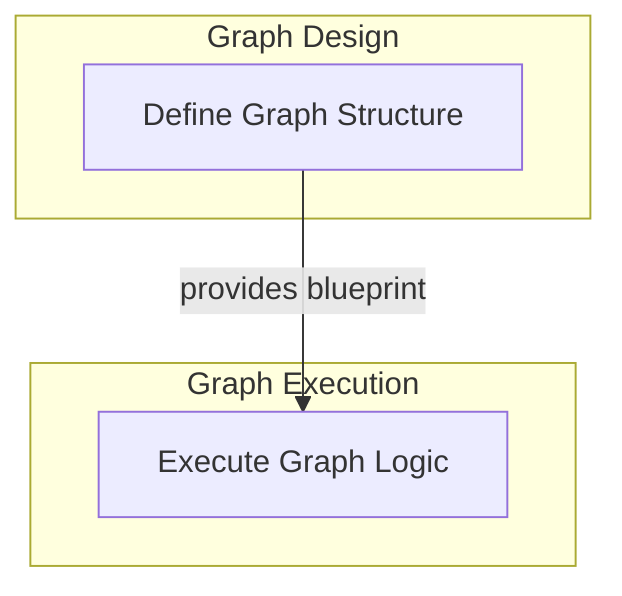

# Graph Execution Engine

The `graph_execution_engine` module is the core component for defining, executing, and managing pydantic-based workflow graphs. It provides the foundational mechanisms for asynchronous task processing, managing parallel execution (fork-join patterns), and maintaining state throughout a graph's lifecycle. This module is critical for orchestrating complex AI agent behaviors and data processing pipelines.

## Architecture Overview

The `graph_execution_engine` is composed of two primary sub-modules:

1.  **[Graph Definition](graph_definition.md)**: Responsible for the static structural definition of the workflow graph, including its nodes, edges, and typing.
2.  **[Graph Runtime](graph_runtime.md)**: Handles the dynamic execution of a defined graph, managing task scheduling, iteration, and the overall flow of data and control.

These sub-modules work in concert, where the `Graph Definition` provides the blueprint that the `Graph Runtime` brings to life.

<!-- DIAGRAM_JSON
{
    "direction": "TD",
    "nodes": [
        {"id": "graph_definition", "label": "Define Graph Structure", "type": "module", "link": "graph_definition.md"},
        {"id": "graph_runtime", "label": "Execute Graph Logic", "type": "module", "link": "graph_runtime.md"}
    ],
    "edges": [
        {"source": "graph_definition", "target": "graph_runtime", "label": "provides blueprint"}
    ],
    "groups": [
        {
            "id": "design_phase",
            "label": "Graph Design",
            "role": "analytical",
            "nodes": ["graph_definition"]
        },
        {
            "id": "execution_phase",
            "label": "Graph Execution",
            "role": "generative",
            "nodes": ["graph_runtime"]
        }
    ]
}
-->

## Sub-modules

### Graph Definition
The `graph_definition` sub-module encapsulates the `Graph` component, which is responsible for establishing the static structure of a workflow graph. This includes defining its nodes, edges, input/output types, state, and dependencies. It serves as the blueprint that the execution engine follows.

### Graph Runtime
The `graph_runtime` sub-module contains the `GraphRun` and `_GraphIterator` components. `GraphRun` manages a single execution instance of a graph, orchestrating tasks, handling parallel execution patterns (fork/join), and tracking the overall state. The `_GraphIterator` provides the core asynchronous iteration logic, processing tasks and managing the flow of control and data within the active graph run.

