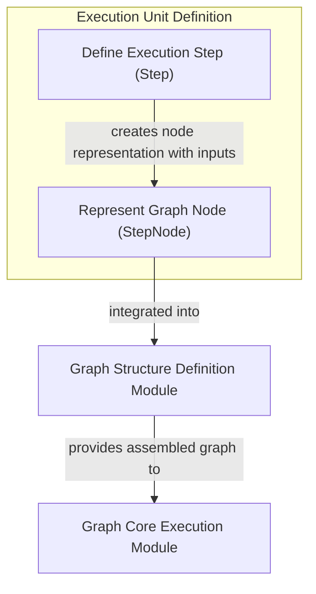

# Module: `graph_execution_steps`

## Introduction

The `graph_execution_steps` module is a foundational component within the `pydantic_ai_agent_core` system, specifically designed to define and manage individual units of work, or "steps," within a graph-based execution framework. It provides the core `Step` component, which encapsulates a specific function, allowing it to be treated as an atomic, addressable node in a larger computational graph. This module is crucial for structuring complex agent behaviors and workflows into a series of interconnected, manageable operations.

## Comprehensive Documentation

At the heart of this module is the `Step` class, which serves as a lightweight wrapper around any callable function that represents a single logical operation in a graph. Each `Step` is uniquely identified by an `id` and can optionally have a human-readable `label`. The primary purpose of `Step` is to formalize these callable units so they can be seamlessly integrated into a graph structure.

### The `Step` Component

The `Step` class (core component `pydantic_graph.pydantic_graph.beta.step.Step`) is defined with the following key characteristics:

-   **`id` (NodeID)**: A mandatory, unique identifier for the step within the graph. This allows for precise referencing and tracking of individual operations.
-   **`_call` (StepFunction)**: The actual Python callable (function) that the step represents. This function performs the core logic of the step. It is exposed via the `call` property for proper type variance inference.
-   **`label` (str | None)**: An optional, descriptive name for the step, enhancing readability and understanding of the graph's flow.

The `Step` class is generic, allowing it to be parameterized with `StateT` (the graph's overall state type), `DepsT` (dependencies required by the step function), `InputT` (the input type for this specific step), and `OutputT` (the output type produced by this step). This strong typing ensures consistency and helps in building robust graph definitions.

### Integration with Graph Execution

A key method of the `Step` class is `as_node()`. This method transforms a `Step` into a [`StepNode`][pydantic_graph.beta.step.StepNode], optionally binding specific input data to it. The `StepNode` then becomes the concrete representation of a step that can be used to construct the overall graph structure by the [`graph_structure_definition`](graph_structure_definition.md) module.

Once the graph is assembled from these `StepNode`s, the [`graph_core_execution`](graph_core_execution.md) module takes responsibility for orchestrating the execution of these steps in the defined order, managing state transitions and data flow between them. This modular design ensures that the definition of individual steps is decoupled from how they are structured into a graph and how that graph is ultimately executed.

This module thus provides the essential atomic units for building complex, observable, and debuggable graph-based AI agent workflows.

<!-- DIAGRAM_JSON
{
    "direction": "TD",
    "nodes": [
        {"id": "Step", "label": "Define Execution Step (Step)", "type": "component", "link": null},
        {"id": "StepNode", "label": "Represent Graph Node (StepNode)", "type": "component", "link": null},
        {"id": "graph_structure_definition", "label": "Graph Structure Definition Module", "type": "external", "link": "graph_structure_definition.md"},
        {"id": "graph_core_execution", "label": "Graph Core Execution Module", "type": "external", "link": "graph_core_execution.md"}
    ],
    "edges": [
        {"source": "Step", "target": "StepNode", "label": "creates node representation with inputs"},
        {"source": "StepNode", "target": "graph_structure_definition", "label": "integrated into"},
        {"source": "graph_structure_definition", "target": "graph_core_execution", "label": "provides assembled graph to"}
    ],
    "groups": [
        {
            "id": "execution_unit_definition",
            "label": "Execution Unit Definition",
            "role": "structural",
            "nodes": ["Step", "StepNode"]
        }
    ]
}
-->

