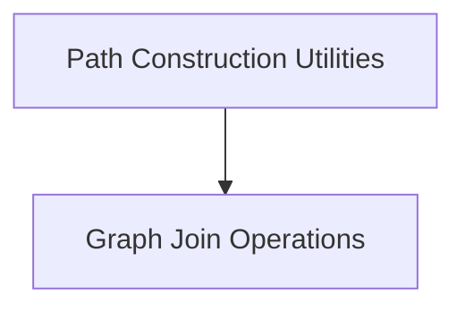

# Graph Path and Flow Module

The `graph_path_and_flow` module is a core component within the `pydantic_graph_beta` package, responsible for defining and managing the execution paths and synchronization points (joins) within a graph-based system. It provides mechanisms for building complex sequences of operations and handling parallel execution flows.

## Architecture Overview

The module is composed of two primary sub-modules:

- **Join Operations**: Handles the aggregation of results from parallel branches.
- **Path Building**: Provides a fluent API for constructing and manipulating execution paths.

<!-- DIAGRAM_JSON
{
    "direction": "TD",
    "nodes": [
        {"id": "join_operations", "label": "Graph Join Operations", "type": "module", "link": "join_operations.md"},
        {"id": "path_building", "label": "Path Construction Utilities", "type": "module", "link": "path_building.md"}
    ],
    "edges": [
        {"source": "path_building", "target": "join_operations"}
    ],
    "groups": []
}
-->

## Sub-modules

### [Graph Join Operations](join_operations.md)
This sub-module, primarily through the `Join` component, manages the synchronization and aggregation of parallel execution paths within the graph. It defines how to combine outputs from multiple parallel execution paths using a reducer function, specifying which fork it joins and managing reducer initialization.

### [Path Construction Utilities](path_building.md)
This sub-module, centered around the `PathBuilder` component, provides a fluent interface for creating execution paths by chaining operations such as transformations, maps, and routing to destinations. It allows for the construction of complex graph workflows in a readable and declarative manner.