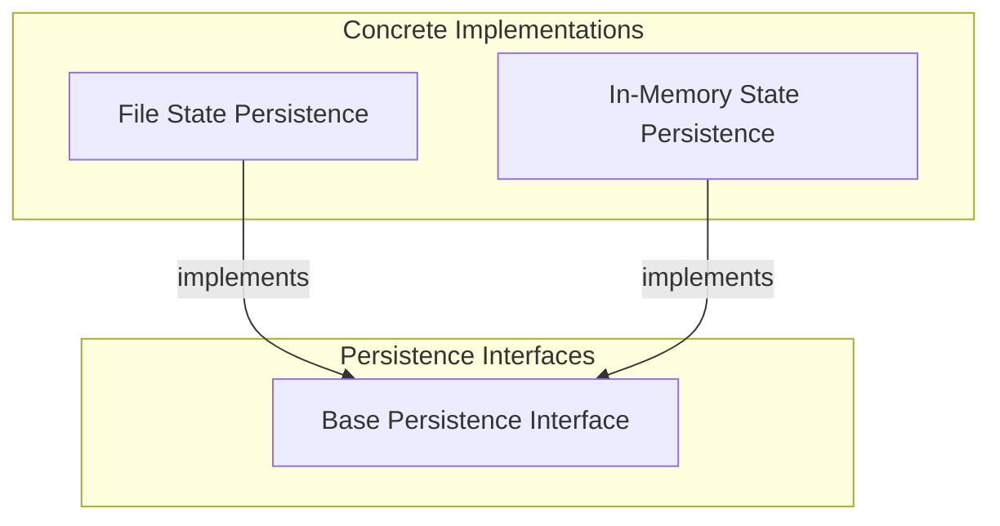

# Graph Persistence Module

The `graph_persistence` module provides robust mechanisms for saving and loading the state of graph executions. This is crucial for enabling features such as resuming long-running processes, debugging complex graph workflows, and maintaining an audit trail of graph states and transitions. By abstracting the storage mechanism, it allows developers to choose between various persistence strategies, including file-based and in-memory options.

## Architecture Overview

The `graph_persistence` module is built around a core abstract interface, `BaseStatePersistence`, which defines the contract for any state persistence implementation. Concrete implementations then extend this base class to provide specific storage solutions.

<!-- DIAGRAM_JSON
{
    "direction": "TD",
    "nodes": [
        {
            "id": "graph_persistence",
            "label": "Graph Persistence",
            "type": "module"
        },
        {
            "id": "base_persistence_interface",
            "label": "Base Persistence Interface",
            "type": "module",
            "link": "base_persistence_interface.md"
        },
        {
            "id": "file_state_persistence",
            "label": "File State Persistence",
            "type": "module",
            "link": "file_state_persistence.md"
        },
        {
            "id": "in_memory_state_persistence",
            "label": "In-Memory State Persistence",
            "type": "module",
            "link": "in_memory_state_persistence.md"
        }
    ],
    "edges": [
        {
            "source": "file_state_persistence",
            "target": "base_persistence_interface",
            "label": "implements"
        },
        {
            "source": "in_memory_state_persistence",
            "target": "base_persistence_interface",
            "label": "implements"
        }
    ],
    "groups": [
        {
            "id": "interfaces",
            "label": "Persistence Interfaces",
            "role": "analytical",
            "nodes": [
                "base_persistence_interface"
            ]
        },
        {
            "id": "implementations",
            "label": "Concrete Implementations",
            "role": "data",
            "nodes": [
                "file_state_persistence",
                "in_memory_state_persistence"
            ]
        }
    ]
}
-->

## Sub-modules

This module contains the following sub-modules, each providing a specific aspect of graph state persistence:

*   **[Base Persistence Interface](base_persistence_interface.md)**: Defines the abstract interface for storing and managing the state of a graph run, outlining essential methods for snapshotting nodes and graph ends, and recording run progress.
*   **[File State Persistence](file_state_persistence.md)**: Provides a concrete implementation for graph state persistence, storing snapshots in a structured JSON file. This allows for durable storage and easy retrieval of graph run history.
*   **[In-Memory State Persistence](in_memory_state_persistence.md)**: Offers an ephemeral, in-memory solution for storing graph run snapshots. It's particularly useful for testing, short-lived processes, or scenarios where persistent storage is not required.
