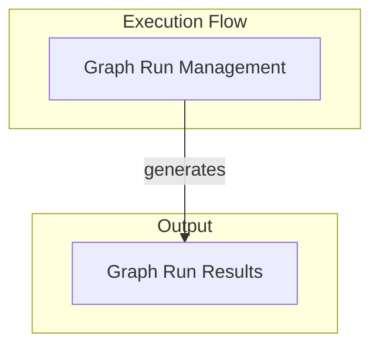

# Graph Runtime Module

## Introduction
The `graph_runtime` module is a crucial component within the `pydantic_ai_agent_core` system, specifically designed for managing the execution and state of AI agent graphs. It provides the core mechanisms for iterating through graph nodes, handling state persistence, and encapsulating the results of a graph's execution. This module is essential for agents that operate based on a defined graph structure, enabling dynamic, observable, and debuggable execution flows.

## Architecture Overview
The `graph_runtime` module orchestrates the execution of predefined computational graphs. It primarily consists of two key functional areas: managing the ongoing execution of a graph (`GraphRun`) and encapsulating the final outcomes (`GraphRunResult`). These components work in tandem to provide a robust and observable graph execution environment.

<!-- DIAGRAM_JSON
{
    "direction": "TD",
    "nodes": [
        {"id": "graph_run_management", "label": "Graph Run Management", "type": "module", "link": "graph_run_management.md"},
        {"id": "graph_run_results", "label": "Graph Run Results", "type": "module", "link": "graph_run_results.md"}
    ],
    "edges": [
        {"source": "graph_run_management", "target": "graph_run_results", "label": "generates"}
    ],
    "groups": [
        {
            "id": "execution_flow",
            "label": "Execution Flow",
            "role": "generative",
            "nodes": ["graph_run_management"]
        },
        {
            "id": "output",
            "label": "Output",
            "role": "data",
            "nodes": ["graph_run_results"]
        }
    ]
}
-->

## Sub-modules and their Functionality

### [Graph Run Management](graph_run_management.md)
This sub-module is responsible for the actual execution lifecycle of a graph. It allows for asynchronous iteration over graph nodes, enabling detailed control and observation of the graph's progression. It handles state updates and interactions with persistence layers, making the graph's execution resilient and traceable.

### [Graph Run Results](graph_run_results.md)
This sub-module captures the final outcome of a completed graph run. It provides access to the graph's final output data, the state of the system at the end of the run, and the persistence mechanisms used. This allows for post-execution analysis and retrieval of critical information.

