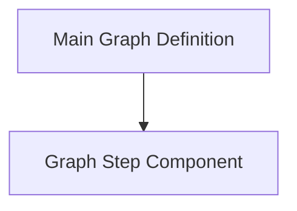

# Graph Structure Definition

The `graph_structure_definition` module provides the foundational components for constructing and executing directed acyclic graphs (DAGs) within the `pydantic_graph.beta` framework. It defines the core structures that enable the creation of robust, typed, and observable workflows.

## Purpose

This module's primary purpose is to establish the fundamental architecture for defining graph-based computations. It allows developers to:

*   **Define comprehensive workflows:** Using the `Graph` class to encapsulate the entire structure, including nodes, edges, state, inputs, and outputs.
*   **Modularize execution units:** Through the `Step` class, which represents individual, reusable units of work within a larger graph.
*   **Enable structured execution:** Providing mechanisms to run graphs to completion or iterate through steps for fine-grained control.
*   **Visualize graph structures:** Offering functionality to render graphs as Mermaid diagrams for better understanding and debugging.

## Architecture Overview

The `graph_structure_definition` module is centered around two primary components: the `Graph` itself, which orchestrates the entire workflow, and `Step` objects, which represent the atomic operations within that workflow. The `Graph` object holds a collection of `Step` (or other `Node`) objects and defines the paths and relationships between them. It is responsible for managing the graph's state, dependencies, and overall execution.

### Sub-modules

This module is composed of the following sub-modules, each focusing on a specific aspect of graph definition:

*   **[Main Graph Definition](graph_definition_main.md)**: Details the `Graph` class, which is the top-level container for a workflow.
*   **[Graph Step Component](graph_step_component.md)**: Describes the `Step` class, representing individual callable units within the graph.

<!-- DIAGRAM_JSON
{
    "direction": "TD",
    "nodes": [
        {"id": "graph_definition_main", "label": "Main Graph Definition", "type": "module", "link": "graph_definition_main.md"},
        {"id": "graph_step_component", "label": "Graph Step Component", "type": "module", "link": "graph_step_component.md"}
    ],
    "edges": [
        {"source": "graph_definition_main", "target": "graph_step_component"}
    ],
    "groups": []
}
-->

