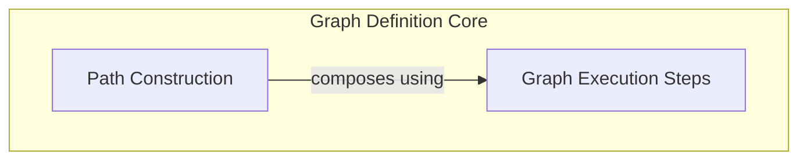

# Graph Structure Definition

The `graph_structure_definition` module is a core component within the `pydantic_ai_agent_core`'s `graph_beta_features` that focuses on defining the structure and flow of execution graphs. It provides the building blocks for creating complex, directed acyclic graphs (DAGs) that orchestrate agent actions, data transformations, and parallel processing. This module is crucial for enabling the flexible and programmatic construction of agent behaviors and data pipelines within the Pydantic AI Agent framework.

## Architecture Overview

This module is designed to provide a fluent and robust way to define the execution flow of an AI agent. It separates the concerns of building a path (how steps connect) from the definition of an individual step (what a single unit of work does).

<!-- DIAGRAM_JSON
{
    "direction": "TD",
    "nodes": [
        {
            "id": "graph_structure_definition",
            "label": "Graph Structure Definition",
            "type": "module"
        },
        {
            "id": "path_construction",
            "label": "Path Construction",
            "type": "module",
            "link": "path_construction.md"
        },
        {
            "id": "graph_execution_steps",
            "label": "Graph Execution Steps",
            "type": "module",
            "link": "graph_execution_steps.md"
        }
    ],
    "edges": [
        {
            "source": "path_construction",
            "target": "graph_execution_steps",
            "label": "composes using"
        }
    ],
    "groups": [
        {
            "id": "graph_definition",
            "label": "Graph Definition Core",
            "role": "generative",
            "nodes": [
                "path_construction",
                "graph_execution_steps"
            ]
        }
    ]
}
-->

## Sub-modules

This module consists of the following key sub-modules:

### [Path Construction](path_construction.md)
This sub-module defines the fluent API for building execution paths within the graph, allowing chained operations for routing, transformation, and parallel execution. It provides the `PathBuilder` component.

### [Graph Execution Steps](graph_execution_steps.md)
This sub-module represents individual, atomic units of work in the graph, encapsulating a step function and associated metadata. It provides the `Step` component.
