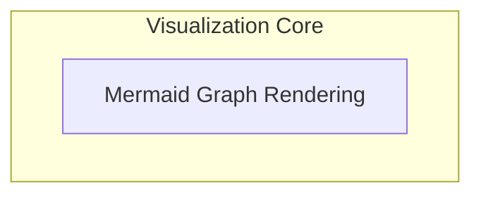

# Graph Visualization Module

## Introduction
The `graph_visualization` module is responsible for transforming the internal representation of a pydantic graph into a human-readable visual format using Mermaid diagrams. This module is crucial for debugging, understanding complex agent execution flows, and providing clear architectural overviews.

## Architecture Overview
The module primarily focuses on generating Mermaid state diagrams. It processes graph paths and their associated nodes and edges to construct a visual representation. The core logic resides within the Mermaid graph rendering components, which handle the detailed syntax generation for various node types and edges.

<!-- DIAGRAM_JSON
{
    "direction": "TD",
    "nodes": [
        {"id": "mermaid_graph_rendering", "label": "Mermaid Graph Rendering", "type": "module", "link": "mermaid_graph_rendering.md"}
    ],
    "edges": [],
    "groups": [
        {
            "id": "visualization_core",
            "label": "Visualization Core",
            "role": "generative",
            "nodes": ["mermaid_graph_rendering"]
        }
    ]
}
-->

## High-level Functionality

### Mermaid Graph Rendering
This sub-module (documented in [mermaid_graph_rendering.md](mermaid_graph_rendering.md)) is the heart of the visualization process. It contains the logic for collecting graph edges and rendering them into a Mermaid state diagram. It manages different node types and ensures proper diagram syntax.
