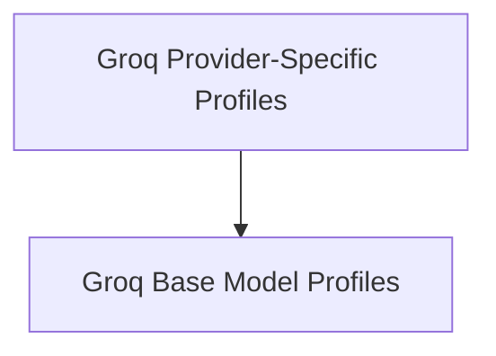

# Groq Model Configurations

The `groq_model_configurations` module is responsible for defining and managing model profiles specifically for Groq models, as well as integrating model profiles from other providers (MoonshotAI, Meta) when they are used with the Groq provider. This module ensures that models interacting with the Groq ecosystem have the correct capabilities and settings applied, such as support for reasoning, JSON output, and web search tools.

## Architecture Overview

This module is logically divided into sub-modules that handle the base Groq model profiles and profiles for external models when they are leveraged through the Groq provider.

<!-- DIAGRAM_JSON
{
    "direction": "TD",
    "nodes": [
        {"id": "groq_base_profiles", "label": "Groq Base Model Profiles", "type": "module", "link": "groq_base_profiles.md"},
        {"id": "groq_provider_specific_profiles", "label": "Groq Provider-Specific Profiles", "type": "module", "link": "groq_provider_specific_profiles.md"}
    ],
    "edges": [
        {"source": "groq_provider_specific_profiles", "target": "groq_base_profiles"}
    ],
    "groups": []
}
-->

## Sub-modules

### [Groq Base Model Profiles](groq_base_profiles.md)
This sub-module focuses on defining the core `ModelProfile` for Groq's own models, determining features like reasoning capabilities and built-in tool support based on the model name.

### [Groq Provider-Specific Profiles](groq_provider_specific_profiles.md)
This sub-module extends the Groq model profiling to include models from other providers, specifically MoonshotAI and Meta, when they are utilized through the Groq ecosystem. It ensures compatibility and correct feature mapping, particularly for JSON object and schema output capabilities.
