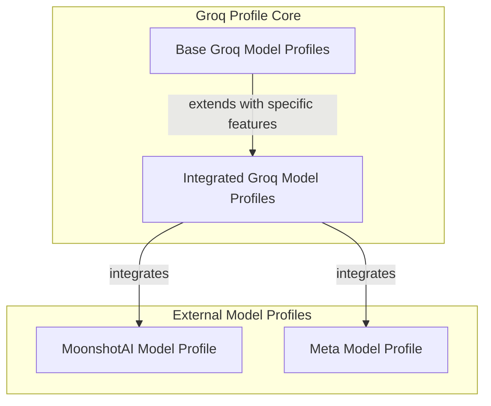

# Groq Profiles Module

The `groq_profiles` module is a crucial component within the `pydantic_ai_slim` framework, specifically designed to define and manage model profiles for Groq-powered large language models. This module ensures that AI agents can correctly configure and interact with various Groq models, optimizing their behavior based on model-specific capabilities such as web search integration, JSON output support, and reasoning abilities.

It plays a vital role in adapting the framework's interaction with Groq's diverse model offerings, including native Groq models and those integrated from other providers like MoonshotAI and Meta. This dynamic profiling allows the system to leverage the unique strengths of each model, enhancing the flexibility and performance of AI agents.

## Architecture

The `groq_profiles` module is structured into several sub-modules that handle different aspects of model profiling:

<!-- DIAGRAM_JSON
{
    "direction": "TD",
    "nodes": [
        {
            "id": "groq_profiles",
            "label": "Groq Model Profiles",
            "type": "module"
        },
        {
            "id": "base_groq_profiles",
            "label": "Base Groq Model Profiles",
            "type": "module",
            "link": "base_groq_profiles.md"
        },
        {
            "id": "integrated_groq_profiles",
            "label": "Integrated Groq Model Profiles",
            "type": "module",
            "link": "integrated_groq_profiles.md"
        },
        {
            "id": "moonshotai_profile",
            "label": "MoonshotAI Model Profile",
            "type": "external",
            "link": "model_profile_definitions.md"
        },
        {
            "id": "meta_profile",
            "label": "Meta Model Profile",
            "type": "external",
            "link": "model_profile_definitions.md"
        }
    ],
    "edges": [
        {
            "source": "base_groq_profiles",
            "target": "integrated_groq_profiles",
            "label": "extends with specific features"
        },
        {
            "source": "integrated_groq_profiles",
            "target": "moonshotai_profile",
            "label": "integrates"
        },
        {
            "source": "integrated_groq_profiles",
            "target": "meta_profile",
            "label": "integrates"
        }
    ],
    "groups": [
        {
            "id": "groq_profiles_core",
            "label": "Groq Profile Core",
            "role": "generative",
            "nodes": [
                "base_groq_profiles",
                "integrated_groq_profiles"
            ]
        },
        {
            "id": "external_model_profiles",
            "label": "External Model Profiles",
            "role": "data",
            "nodes": [
                "moonshotai_profile",
                "meta_profile"
            ]
        }
    ]
}
-->

## Sub-modules

### [Base Groq Model Profiles](base_groq_profiles.md)
This sub-module defines the fundamental characteristics and capabilities of native Groq models within the `pydantic_ai_slim` framework. It includes logic to determine if a model supports advanced features like reasoning and web search, based on its naming conventions.

### [Integrated Groq Model Profiles](integrated_groq_profiles.md)
This sub-module handles Groq model profiles that are augmented by or integrated with other model providers such as MoonshotAI and Meta. It extends the base Groq profiles with additional features like JSON object and schema output support, drawing from the profiles defined by these external providers.

## Connections to Other Modules

The `groq_profiles` module primarily interacts with the `model_provider_configurations` module, where general model profiles for various providers (including MoonshotAI and Meta) are defined. It extends and specializes these profiles for the Groq ecosystem.

- **`model_provider_configurations`**: This module defines generic model profiles for various providers. The `groq_profiles` module leverages and builds upon these foundational profiles to create Groq-specific configurations. See [model_provider_configurations.md](model_provider_configurations.md) for more details.
