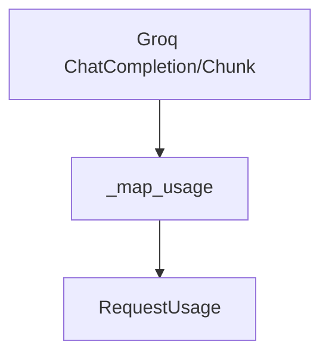

# Groq Usage Mapping Module

This module, `groq_usage_mapping`, is responsible for translating Groq API's specific usage information into a standardized internal `RequestUsage` format. This standardization is crucial for consistent usage tracking and reporting across different model providers within the `pydantic_ai_models` framework.

## Core Functionality

The primary function of this module is to parse the usage data provided by Groq's chat completion responses and convert it into a `RequestUsage` object. This ensures that regardless of the underlying model provider, usage metrics such as input and output tokens are captured uniformly.

### `_map_usage` Function

The `_map_usage` function is the sole core component of this module. It takes either a `chat.ChatCompletionChunk` or a `chat.ChatCompletion` object from the Groq API and extracts the `prompt_tokens` (input_tokens) and `completion_tokens` (output_tokens). If usage information is not directly available, it defaults to an empty `RequestUsage` object, preventing errors and ensuring robust handling of varied API responses.

## Architecture and Component Relationships

The `groq_usage_mapping` module is a leaf module within the `pydantic_ai_models.provider_usage_mapping` sub-system. It primarily interacts with external Groq API response structures and the internal `RequestUsage` data model.

<!-- DIAGRAM_JSON
{
    "direction": "TD",
    "nodes": [
        {"id": "map_usage", "label": "_map_usage", "type": "component", "link": null},
        {"id": "groq_completion", "label": "Groq ChatCompletion/Chunk", "type": "external", "link": null},
        {"id": "request_usage", "label": "RequestUsage", "type": "external", "link": "agent_utilities_results.md"}
    ],
    "edges": [
        {"source": "groq_completion", "target": "map_usage"},
        {"source": "map_usage", "target": "request_usage"}
    ],
    "groups": []
}
-->

## System Integration

This module is an integral part of the `pydantic_ai_models` component, specifically nested under `provider_usage_mapping`. Its role is to provide a unified interface for tracking token usage from Groq models, which feeds into the broader system's cost estimation, logging, and performance monitoring capabilities. By standardizing the usage data, it enables other parts of the system, such as those responsible for logging and reporting, to operate without needing to understand the specifics of each individual model provider's usage reporting mechanism. This design promotes modularity and simplifies the integration of new model providers.

For more information on the `RequestUsage` object, refer to the [agent_utilities_results](agent_utilities_results.md) documentation.