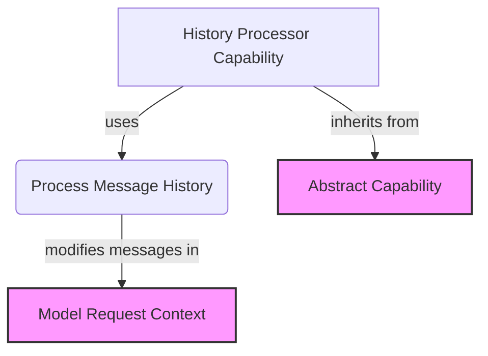

# History Processing Module

## Introduction

The `history_processing` module provides a crucial capability for AI agents: the intelligent management and processing of conversational history. Before an agent makes a request to a language model, this module intercepts and modifies the message history, ensuring that only relevant and optimally formatted information is sent. This capability is vital for maintaining context, reducing token usage, and improving the overall efficiency and accuracy of AI agent interactions.

By centralizing history manipulation, `history_processing` allows developers to implement sophisticated strategies for summarization, filtering, or transformation of past messages, tailoring the agent's memory to specific tasks and model constraints.

## Core Components

The `history_processing` module is built around the `HistoryProcessor` capability.

### `HistoryProcessor`

`pydantic_ai_slim.pydantic_ai.capabilities.history_processor.HistoryProcessor`

The `HistoryProcessor` class is an `AbstractCapability` responsible for executing custom logic on the message history just before a model request is dispatched. It encapsulates a `HistoryProcessorFunc` callable, which defines the specific processing steps.

-   **Purpose**: To preprocess the list of messages in a `ModelRequestContext` before it reaches the language model.
-   **`before_model_request` method**: This asynchronous method is the entry point for history processing. It receives the current `RunContext` and `ModelRequestContext`, applies the configured `processor` function to the `messages` list within the `request_context`, and then returns the modified `ModelRequestContext`.
-   **Customizable Logic**: The actual history manipulation logic is provided by a `HistoryProcessorFunc`, allowing for flexible implementations such as:
    -   **Summarization**: Condensing long conversations into shorter, key points.
    -   **Filtering**: Removing irrelevant or redundant messages.
    -   **Token management**: Adjusting history to fit within model token limits.
    -   **Anonymization**: Stripping sensitive information from past messages.
-   **Serialization**: This capability is not directly serializable via `get_serialization_name`, meaning its specific `processor` function must be instantiated programmatically rather than loaded from a specification.

## How it Works

When an AI agent is about to send a prompt to a language model, the `HistoryProcessor` steps in:

1.  The agent prepares a `ModelRequestContext` containing the current conversation messages.
2.  The `HistoryProcessor`'s `before_model_request` method is invoked as part of the agent's capability pipeline.
3.  Inside `before_model_request`, the configured `HistoryProcessorFunc` (a custom callable) is executed with the current `RunContext` and the list of messages from the `ModelRequestContext`.
4.  The `HistoryProcessorFunc` returns an updated list of messages.
5.  The `ModelRequestContext` is updated with these new messages.
6.  The modified `ModelRequestContext` proceeds to the language model, ensuring the model receives an optimized and relevant history.

## Relationships to Other Modules

-   **`capabilities_base`**: The `HistoryProcessor` extends `AbstractCapability` ([abstract_capability_base.md](abstract_capability_base.md)), inheriting the fundamental structure and lifecycle methods for agent capabilities.
-   **`agent_execution_graph`**: The `ModelRequestContext` object, which `HistoryProcessor` modifies, is a core component within the agent's execution flow, particularly in how model requests are structured and handled ([agent_execution_graph.md](agent_execution_graph.md)).
-   **`agent_utilities`**: Custom history processing functions might leverage utilities for context management or prompt formatting available in the `agent_utilities` module.

## Architecture Diagram

<!-- DIAGRAM_JSON
{
    "direction": "TD",
    "nodes": [
        {"id": "history_processor_capability", "label": "History Processor Capability", "type": "component", "link": null},
        {"id": "process_messages", "label": "Process Message History", "type": "component", "link": null},
        {"id": "abstract_capability", "label": "Abstract Capability", "type": "external", "link": "abstract_capability_base.md"},
        {"id": "model_request_context", "label": "Model Request Context", "type": "external", "link": "agent_execution_graph.md"}
    ],
    "edges": [
        {"source": "history_processor_capability", "target": "abstract_capability", "label": "inherits from"},
        {"source": "history_processor_capability", "target": "process_messages", "label": "uses"},
        {"source": "process_messages", "target": "model_request_context", "label": "modifies messages in"}
    ]
}
-->
