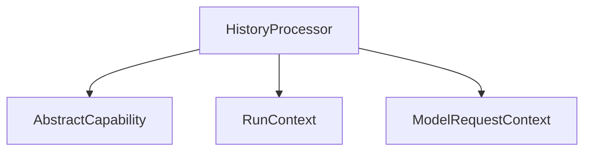

# history_processing Module

The `history_processing` module provides capabilities for intercepting and processing the message history before it is sent to a language model. This allows for dynamic modification, filtering, or enrichment of the conversational context based on application-specific logic.

## Purpose and Core Functionality

The primary purpose of this module is to enable the manipulation of chat history within an agent's workflow. It introduces the `HistoryProcessor` capability, which executes a user-defined function on the message history just before a model request is made. This is crucial for scenarios requiring:
*   **Contextual filtering**: Removing irrelevant or sensitive messages.
*   **Message summarization**: Condensing long conversations to fit token limits.
*   **Dynamic prompt engineering**: Injecting system instructions or few-shot examples based on current state.
*   **History truncation**: Managing the length of the conversation history.

## Architecture and Component Relationships

The `history_processing` module centers around the `HistoryProcessor` class.

<!-- DIAGRAM_JSON
{
    "direction": "TD",
    "nodes": [
        {"id": "history_processor_comp", "label": "HistoryProcessor", "type": "component", "link": null},
        {"id": "abstract_capability", "label": "AbstractCapability", "type": "external", "link": "capability_core.md"},
        {"id": "run_context", "label": "RunContext", "type": "external", "link": "pydantic_ai_agent_core.md"},
        {"id": "model_request_context", "label": "ModelRequestContext", "type": "external", "link": "model_request_handling.md"}
    ],
    "edges": [
        {"source": "history_processor_comp", "target": "abstract_capability"},
        {"source": "history_processor_comp", "target": "run_context"},
        {"source": "history_processor_comp", "target": "model_request_context"}
    ],
    "groups": []
}
-->

### Core Components

#### `HistoryProcessor`
- **Description**: This class implements the core logic for processing message history. It inherits from `AbstractCapability` and defines a `processor` attribute, which is a callable function (`HistoryProcessorFunc`) responsible for modifying the list of messages.
- **`before_model_request(self, ctx, request_context)`**: This asynchronous method is invoked before a model request is made. It takes the current `RunContext` and `ModelRequestContext` as input. Inside this method, the configured `processor` function is executed, applying its logic to `request_context.messages`. The modified `ModelRequestContext` is then returned.
- **`get_serialization_name()`**: Returns `None`, indicating that `HistoryProcessor` instances are not directly serializable due to their reliance on a callable `processor` function.

### Relationships with Other Modules

*   **`capability_core`**: The `HistoryProcessor` extends `[AbstractCapability](capability_core.md)`, leveraging the foundational structure for defining agent capabilities.
*   **`pydantic_ai_agent_core`**: The `HistoryProcessor` interacts with `[RunContext](pydantic_ai_agent_core.md)` for accessing agent-wide execution context.
*   **`model_request_handling`**: It modifies `[ModelRequestContext](model_request_handling.md)`, which is a key data structure used by the `model_request_handling` module to encapsulate all information related to a model call. This ensures that the processed message history is what the model ultimately receives.

## How the Module Fits into the Overall System

The `history_processing` module is a vital part of the `pydantic_ai_capabilities` package, specifically within the `agent_behaviors` subgroup. It provides a flexible extension point for agents to customize how they manage and present conversational history to large language models.

By plugging in custom `HistoryProcessorFunc` implementations, developers can implement sophisticated context management strategies without altering the core agent execution flow. This modularity enhances the agent's ability to handle complex conversations, adhere to context window limitations, and maintain desired conversational traits. It acts as an interceptor in the agent's thought process, ensuring that the model always receives an optimized and relevant set of prior messages.