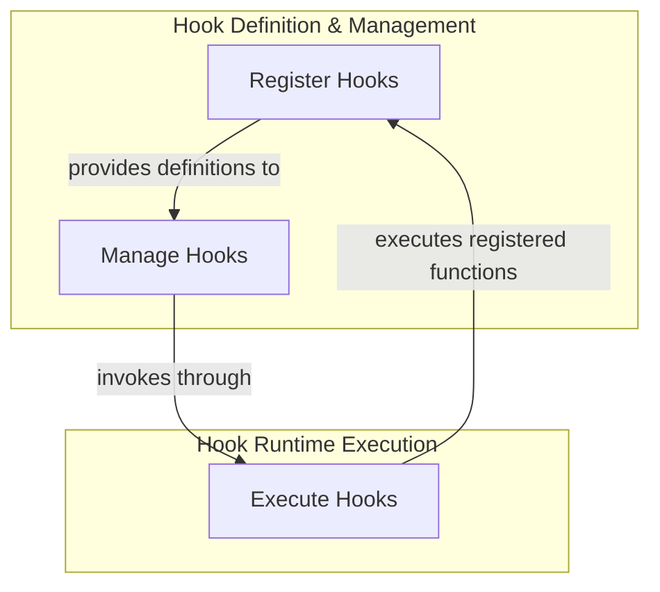

# Hook Internals Module

## Introduction

The `hook_internals` module is a fundamental component within the system's extensibility framework. It provides the core mechanisms for defining, registering, and executing asynchronous hooks. These hooks allow developers to inject custom logic at specific points in an agent's execution flow, enabling advanced customization, event-driven behaviors, and seamless integration of new functionalities without modifying core agent code. This module ensures that the agent's behavior can be dynamically altered and extended.

## Architecture Overview

The `hook_internals` module works in conjunction with the broader [Hook System](hook_system.md) and [Hook Management](hook_management.md) to provide a robust and flexible event-handling infrastructure. It defines the low-level implementation details for how hooks are structured and invoked.

<!-- DIAGRAM_JSON
{
    "direction": "TD",
    "nodes": [
        {
            "id": "hook_internals",
            "label": "Hook Internal Mechanisms",
            "type": "module"
        },
        {
            "id": "hook_registration",
            "label": "Register Hooks",
            "type": "module",
            "link": "hook_registration.md"
        },
        {
            "id": "hook_execution_wrappers",
            "label": "Execute Hooks",
            "type": "module",
            "link": "hook_execution_wrappers.md"
        },
        {
            "id": "hook_management",
            "label": "Manage Hooks",
            "type": "external",
            "link": "hook_management.md"
        }
    ],
    "edges": [
        {
            "source": "hook_registration",
            "target": "hook_management",
            "label": "provides definitions to"
        },
        {
            "source": "hook_management",
            "target": "hook_execution_wrappers",
            "label": "invokes through"
        },
        {
            "source": "hook_execution_wrappers",
            "target": "hook_registration",
            "label": "executes registered functions"
        }
    ],
    "groups": [
        {
            "id": "hook_definition",
            "label": "Hook Definition & Management",
            "role": "analytical",
            "nodes": [
                "hook_registration",
                "hook_management"
            ]
        },
        {
            "id": "hook_runtime",
            "label": "Hook Runtime Execution",
            "role": "generative",
            "nodes": [
                "hook_execution_wrappers"
            ]
        }
    ]
}
-->

## Sub-modules

This module comprises the following key sub-modules:

*   **[Hook Registration Mechanism](hook_registration.md)**: This sub-module focuses on the `decorator` component, which is used to mark functions as hooks and register them within the system. It allows for specifying critical parameters such as execution timeouts and associated tools, ensuring that hooks are properly configured before they are invoked.

*   **[Hook Execution Wrappers](hook_execution_wrappers.md)**: This sub-module contains the `wrapper` and `wrapper_no_arg` components. These asynchronous functions are responsible for the actual invocation of registered hooks. They handle the dynamic passing of arguments to the hook function, if required, and ensure that the hook is called correctly within the system's asynchronous execution environment.