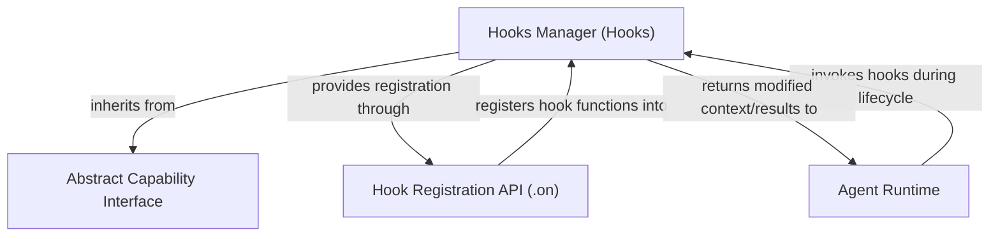

# Module: `hook_management`

The `hook_management` module, centered around the `Hooks` class, provides a flexible and powerful mechanism for extending and modifying the behavior of AI agents at various points in their lifecycle. It allows developers to inject custom logic before or after significant events, wrap existing operations, or handle errors, all without altering the core agent implementation. This is crucial for observability, custom logging, dynamic context modification, and implementing cross-cutting concerns.

## Core Component: `Hooks`

The `Hooks` class serves as the central registry and dispatcher for all agent lifecycle hooks. It enables developers to define custom functions that are automatically invoked at predefined points during an agent's execution, such as before a model request, after a tool execution, or during error handling.

### Key Capabilities

*   **Declarative Hook Registration**: Hooks can be registered using a convenient decorator-based API (`@hooks.on.before_model_request`) or by passing functions directly to the `Hooks` constructor.
*   **Comprehensive Lifecycle Coverage**: The module provides hooks for a wide array of agent operations, including:
    *   **Run Lifecycle**: Events related to the overall agent run (start, end, errors).
    *   **Node Lifecycle**: Events associated with individual nodes within the agent's execution graph (e.g., specific processing steps).
    *   **Event Stream Management**: Intercepting and modifying the stream of events generated during a run.
    *   **Model Interaction**: Hooks before, after, and wrapping calls to the underlying language model, as well as error handling.
    *   **Tool Management**: Hooks for preparing tool definitions, validating tool arguments, executing tools, and handling tool-related errors.
*   **Flexible Hook Types**:
    *   `before_` hooks: Execute logic *before* an event, potentially modifying input arguments.
    *   `after_` hooks: Execute logic *after* an event, potentially modifying results.
    *   `wrap_` hooks: Wrap an entire operation, allowing for custom pre- and post-processing, or even completely replacing the original operation.
    *   `on_error_` hooks: Specifically handle exceptions that occur during an operation.
*   **Integration with `AbstractCapability`**: The `Hooks` class extends `AbstractCapability`, meaning it integrates seamlessly into the agent's capability system. This allows hooks to access the `RunContext` and other agent dependencies, providing rich contextual information.

### How it Works

When an `Agent` is initialized with a `Hooks` instance, the registered functions are stored internally. As the agent executes, its core components, which inherit from `AbstractCapability`, call into the registered hook functions at their respective invocation points. The `Hooks` manager ensures that `before` hooks are executed first, `wrap` hooks create a callable chain around the core logic, `after` hooks process the results, and `on_error` hooks catch exceptions.

This layered approach allows for granular control over agent behavior, enabling developers to build sophisticated extensions and monitoring tools.

<!-- DIAGRAM_JSON
{
    "direction": "TD",
    "nodes": [
        {
            "id": "hooks_manager",
            "label": "Hooks Manager (Hooks)",
            "type": "component",
            "link": null
        },
        {
            "id": "abstract_capability_interface",
            "label": "Abstract Capability Interface",
            "type": "external",
            "link": "capability_interface.md"
        },
        {
            "id": "hook_registration_api",
            "label": "Hook Registration API (.on)",
            "type": "component",
            "link": null
        },
        {
            "id": "agent_runtime",
            "label": "Agent Runtime",
            "type": "external",
            "link": "agent_definition.md"
        }
    ],
    "edges": [
        {
            "source": "hooks_manager",
            "target": "abstract_capability_interface",
            "label": "inherits from"
        },
        {
            "source": "hooks_manager",
            "target": "hook_registration_api",
            "label": "provides registration through"
        },
        {
            "source": "hook_registration_api",
            "target": "hooks_manager",
            "label": "registers hook functions into"
        },
        {
            "source": "agent_runtime",
            "target": "hooks_manager",
            "label": "invokes hooks during lifecycle"
        },
        {
            "source": "hooks_manager",
            "target": "agent_runtime",
            "label": "returns modified context/results to"
        }
    ],
    "groups": []
}
-->

