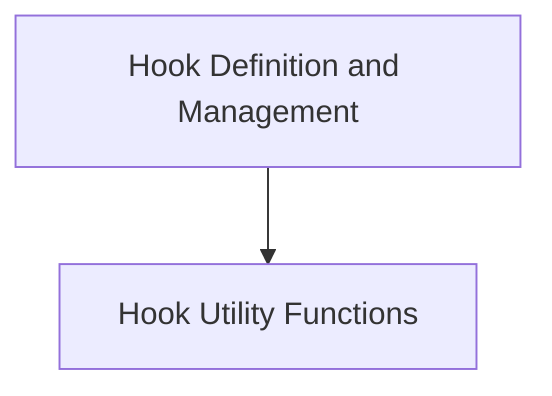

# Hook Management Module

The `hook_management` module provides a flexible and extensible system for injecting custom logic into various stages of the agent's lifecycle. It allows developers to register functions that will be executed before, after, or around key operations, such as model requests, tool executions, and node runs.

## Architecture Overview

The hook management system is built around a central `Hooks` class, which serves as the primary interface for registering and managing hook functions. Various utility functions support the wrapping and invocation of these hooks.

<!-- DIAGRAM_JSON
{
    "direction": "TD",
    "nodes": [
        {"id": "hook_definition_and_management", "label": "Hook Definition and Management", "type": "module", "link": "hook_definition_and_management.md"},
        {"id": "hook_utility_functions", "label": "Hook Utility Functions", "type": "module", "link": "hook_utility_functions.md"}
    ],
    "edges": [
        {"source": "hook_definition_and_management", "target": "hook_utility_functions"}
    ],
    "groups": []
}
-->

## Sub-modules

### [Hook Definition and Management](hook_definition_and_management.md)
This sub-module centers around the `Hooks` class, which is responsible for defining, registering, and managing all available lifecycle hooks. It provides mechanisms for both decorator-based and constructor-based hook registration, enabling developers to easily customize agent behavior at various points in its execution.

### [Hook Utility Functions](hook_utility_functions.md)
This sub-module contains essential utility functions that facilitate the wrapping and invocation of registered hook functions. These helpers ensure that hooks are properly integrated into the agent's execution flow, handling argument passing and function chaining for both synchronous and asynchronous operations.