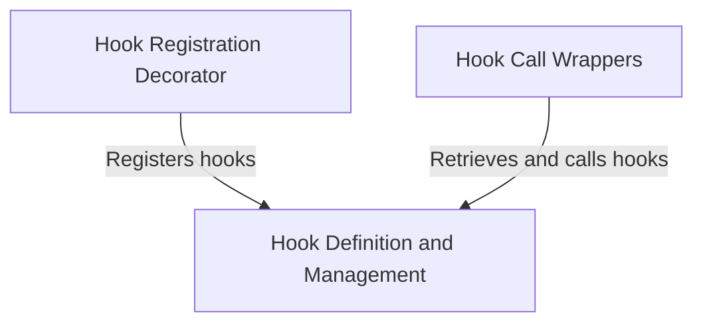

# `hook_registration_decorator` Module Documentation

The `hook_registration_decorator` module provides a flexible mechanism for registering functions as "hooks" within the `pydantic_ai` framework. These hooks can then be dynamically invoked at specific points during agent execution or capability usage, allowing for custom behavior injection without modifying core logic.

### Purpose and Core Functionality

The primary purpose of this module is to offer a decorator, `decorator`, which simplifies the process of registering functions as callable hooks. When a function is decorated, it is added to a central registry along with configurable metadata such as a `timeout` and a set of `tools` it may require. This design promotes a clean separation of concerns, enabling developers to extend or modify system behavior through external functions.

The core functionality revolves around:
*   **Hook Registration**: Providing a decorator that takes a function and registers it with a unique key, an optional execution timeout, and a list of associated tools.

### Architecture and Component Relationships

The `hook_registration_decorator` module is a leaf module within the `hook_utility_functions` submodule of `pydantic_ai_capabilities`. It directly interacts with the core `Hooks` management system for registering the decorated functions.

<!-- DIAGRAM_JSON
{
    "direction": "TD",
    "nodes": [
        {"id": "decorator", "label": "Hook Registration Decorator", "type": "component", "link": null},
        {"id": "hooks_module", "label": "Hook Definition and Management", "type": "external", "link": "hook_definition_and_management.md"},
        {"id": "hook_call_wrappers_module", "label": "Hook Call Wrappers", "type": "external", "link": "hook_call_wrappers.md"}
    ],
    "edges": [
        {"source": "decorator", "target": "hooks_module", "label": "Registers hooks"},
        {"source": "hook_call_wrappers_module", "target": "hooks_module", "label": "Retrieves and calls hooks"}
    ],
    "groups": []
}
-->


**Relationships:**
*   **Hook Registration Decorator (`decorator`)**: This is the central component of this module. It takes a function and uses internal mechanisms (likely provided by the `hooks_module`) to add it to a global registry of hooks.
*   **Hook Definition and Management ([`hook_definition_and_management`](hook_definition_and_management.md))**: This external module is responsible for maintaining the central registry of all hooks (`registry`) and defining the structure of a hook entry (`_ToolHookEntry`). The `decorator` component interacts with this module to store the registered functions.
*   **Hook Call Wrappers ([`hook_call_wrappers`](hook_call_wrappers.md))**: This external module likely contains the logic (`wrapper`, `wrapper_no_arg`) for iterating through the registered hooks in the `hooks_module`'s registry and executing them when certain conditions or events occur.

### How the Module Fits into the Overall System

The `hook_registration_decorator` module plays a crucial role in the extensibility and modularity of the `pydantic_ai` system. By providing a declarative way to register functions as hooks, it enables:
*   **Customization**: Developers can easily inject custom logic at predefined extension points within the framework without altering core code.
*   **Observability**: Hooks can be used for logging, monitoring, or tracing specific events during the execution flow.
*   **Tool Integration**: Hooks can be configured to depend on specific `tools`, ensuring that necessary functionalities are available when the hook is invoked.
*   **Capability Enhancement**: It allows for enhancing the behavior of various capabilities defined in `pydantic_ai_capabilities` by attaching custom pre-processing or post-processing logic.

This module, in conjunction with [`hook_definition_and_management`](hook_definition_and_management.md) and [`hook_call_wrappers`](hook_call_wrappers.md), forms the complete hook management system that allows the `pydantic_ai` framework to be highly adaptable and extensible.

### Core Components

#### `decorator`
The `decorator` function is the core of this module. It is designed to be used as a Python decorator for functions that need to be registered as hooks.

```python
    def decorator(f: _FuncT) -> _FuncT:
        registry.setdefault(key, []).append(_ToolHookEntry(f, timeout=timeout, tools=frozen_tools))
        return f
```

*   **`f: _FuncT`**: The function being decorated, which will be registered as a hook.
*   **`registry`**: A global or module-level dictionary (managed by [`hook_definition_and_management`](hook_definition_and_management.md)) where hooks are stored. The `key` parameter (implicitly passed to the decorator, though not shown in the snippet) determines under which category or event the hook is registered.
*   **`_ToolHookEntry`**: A dataclass or similar structure (defined in [`hook_definition_and_management`](hook_definition_and_management.md)) that encapsulates the hook function (`f`) along with its `timeout` and `tools` metadata.
*   **`timeout`**: An integer representing the maximum time (in seconds) allowed for the hook's execution.
*   **`frozen_tools`**: A collection of tools (e.g., tool names or instances) that this specific hook requires or is associated with.

When `decorator` is applied to a function, it appends a `_ToolHookEntry` instance containing the decorated function and its metadata to a list associated with a specific `key` in the `registry`. It then returns the original function unchanged, allowing it to be called normally in other contexts while also being available as a registered hook.