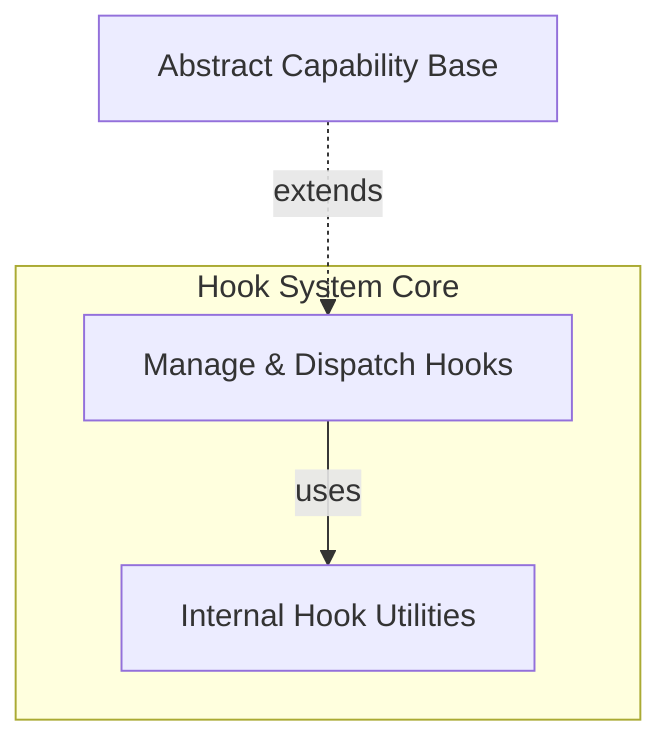

# Hook System Module

The `hook_system` module provides a powerful and flexible mechanism for extending and customizing the behavior of AI agents at various points in their lifecycle. It allows developers to inject custom logic, observe internal processes, and integrate with external systems without modifying the core agent code. This module is crucial for building adaptable, observable, and maintainable AI applications.

## Architecture Overview

The core of the hook system is the `Hooks` capability, which acts as a central registry and dispatcher for various types of hooks. These hooks can be registered either declaratively using decorators or programmatically via constructor arguments.

The system supports several categories of hooks:
*   **Lifecycle Hooks**: Triggered before, after, or wrapping major agent operations like a full run or individual node executions.
*   **Error Hooks**: Specifically designed to catch and handle exceptions that occur during various operations.
*   **Event Stream Hooks**: Allow for processing or modifying the stream of events generated during an agent's execution.
*   **Model Request Hooks**: Intercept and modify interactions with language models, including requests and responses.
*   **Tool Hooks**: Provide fine-grained control over tool preparation, validation, and execution steps.

Internal utility functions and decorators (`wrapper`, `wrapper_no_arg`, `decorator`) underpin the hook registration and invocation process, ensuring consistent and efficient execution of custom logic.

<!-- DIAGRAM_JSON
{
    "direction": "TD",
    "nodes": [
        {"id": "hook_management", "label": "Manage & Dispatch Hooks", "type": "module", "link": "hook_management.md"},
        {"id": "hook_internals", "label": "Internal Hook Utilities", "type": "module", "link": "hook_internals.md"},
        {"id": "capabilities_base", "label": "Abstract Capability Base", "type": "external", "link": "capabilities_base.md"}
    ],
    "edges": [
        {"source": "hook_management", "target": "hook_internals", "label": "uses"},
        {"source": "capabilities_base", "target": "hook_management", "label": "extends"}
    ],
    "groups": [
        {
            "id": "hook_system_core",
            "label": "Hook System Core",
            "role": "generative",
            "nodes": ["hook_management", "hook_internals"]
        }
    ]
}
-->

## Sub-modules

This module is composed of the following sub-modules:

*   ### [Hook Management](hook_management.md)
    This sub-module focuses on the `Hooks` class, which is the primary interface for defining and managing custom logic injection points. It enables developers to register functions that execute at specific stages of an agent's operation, offering extensive control and observability.

*   ### [Hook Internal Mechanisms](hook_internals.md)
    This sub-module contains the foundational components and helper functions such as `wrapper`, `wrapper_no_arg`, and `decorator` that are used internally by the `Hook Management` sub-module to implement and streamline the dynamic registration and execution of hooks.
