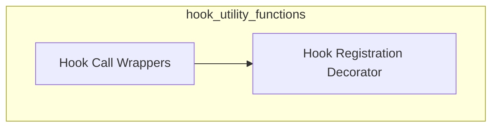

# Hook Utility Functions

The `hook_utility_functions` module provides essential utilities for managing and executing hooks within the `pydantic_ai_slim` framework. These functions facilitate the extension and customization of the system's behavior through a robust hook mechanism, allowing developers to inject custom logic at predefined points.

## Architecture Overview

The module is structured into two main sub-modules, each responsible for a distinct aspect of hook management: handling hook calls and registering new hooks.

<!-- DIAGRAM_JSON
{
    "direction": "TD",
    "nodes": [
        {"id": "hook_call_wrappers", "label": "Hook Call Wrappers", "type": "module", "link": "hook_call_wrappers.md"},
        {"id": "hook_registration_decorator", "label": "Hook Registration Decorator", "type": "module", "link": "hook_registration_decorator.md"}
    ],
    "edges": [
        {"source": "hook_call_wrappers", "target": "hook_registration_decorator"}
    ],
    "groups": []
}
-->

## Sub-modules

### [Hook Call Wrappers](hook_call_wrappers.md)
This sub-module contains functions responsible for wrapping and executing hook calls. It provides asynchronous wrappers that handle the invocation of hook functions, ensuring proper argument passing, context management, and error handling during execution.

### [Hook Registration Decorator](hook_registration_decorator.md)
This sub-module provides a decorator for registering new hooks. It allows developers to easily associate functions with specific hook keys and configurations, integrating them into the system's hook registry for later invocation.