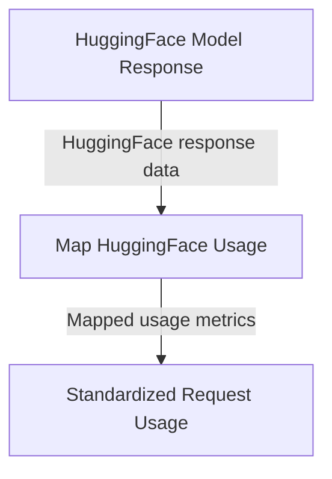

# HuggingFace Usage Mapper Module

## Introduction

The `huggingface_usage_mapper` module is responsible for standardizing the usage reporting from HuggingFace model responses within the `pydantic_ai_agent_core` system. It provides a crucial function to translate specific HuggingFace usage metrics into a common `RequestUsage` format, enabling consistent cost tracking and resource allocation across different language model providers.

## Module Overview

This module contains the core logic for extracting and mapping token usage information from HuggingFace's `ChatCompletionOutput` or `ChatCompletionStreamOutput` objects to the internal `RequestUsage` data structure. This ensures that regardless of the underlying model provider, usage statistics are presented uniformly.

<!-- DIAGRAM_JSON
{
    "direction": "TD",
    "nodes": [
        {"id": "_map_usage", "label": "Map HuggingFace Usage", "type": "component", "link": null},
        {"id": "hf_model_response", "label": "HuggingFace Model Response", "type": "external", "link": null},
        {"id": "request_usage", "label": "Standardized Request Usage", "type": "external", "link": "agent_utilities.md"}
    ],
    "edges": [
        {"source": "hf_model_response", "target": "_map_usage", "label": "HuggingFace response data"},
        {"source": "_map_usage", "target": "request_usage", "label": "Mapped usage metrics"}
    ]
}
-->

### `_map_usage` Function

**Component ID:** `pydantic_ai_slim.pydantic_ai.models.huggingface._map_usage`

This function takes a HuggingFace `ChatCompletionOutput` or `ChatCompletionStreamOutput` object as input and processes its `usage` field. It extracts the `prompt_tokens` and `completion_tokens` and populates a new `RequestUsage` object. If the `usage` field is not present in the HuggingFace response, it returns an empty `RequestUsage` object.

#### Parameters:

*   `response`: An instance of `ChatCompletionOutput` or `ChatCompletionStreamOutput` containing the HuggingFace model's response.

#### Returns:

*   An instance of [RequestUsage](agent_utilities.md) containing the `input_tokens` and `output_tokens` derived from the HuggingFace response.