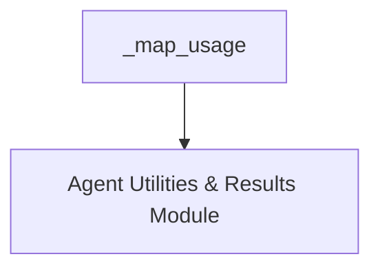

# Hugging Face Usage Mapping Module

## Introduction

The `huggingface_usage_mapping` module is a specialized component within the `pydantic_ai_models` package, specifically designed to standardize the reporting of usage metrics from Hugging Face model responses. It plays a crucial role in normalizing the varying usage formats provided by different AI model providers into a consistent internal `RequestUsage` object.

## Purpose and Core Functionality

The primary purpose of this module is to abstract away the specifics of how Hugging Face models report their token usage. It provides a single, consistent function to transform raw usage data from Hugging Face API responses into a generic `RequestUsage` object, which can then be used uniformly across the system for logging, billing, and performance monitoring.

### Core Component: `_map_usage`

The `_map_usage` function is the central piece of this module. It takes a Hugging Face `ChatCompletionOutput` or `ChatCompletionStreamOutput` object, extracts the prompt and completion token counts, and encapsulates them into a `RequestUsage` instance.

```python
def _map_usage(response: ChatCompletionOutput | ChatCompletionStreamOutput) -> usage.RequestUsage:
    response_usage = response.usage
    if response_usage is None:
        return usage.RequestUsage()

    return usage.RequestUsage(
        input_tokens=response_usage.prompt_tokens,
        output_tokens=response_usage.completion_tokens,
    )
```

## Architecture and Component Relationships

This module contains a single, focused function, `_map_usage`, which acts as a bridge between Hugging Face's specific usage reporting and the system's generalized usage tracking. It depends on the `agent_utilities_results` module for the definition of the `RequestUsage` class.

<!-- DIAGRAM_JSON
{
    "direction": "TD",
    "nodes": [
        {"id": "map_usage", "label": "_map_usage", "type": "component", "link": null},
        {"id": "agent_utilities_results", "label": "Agent Utilities & Results Module", "type": "external", "link": "agent_utilities_results.md"}
    ],
    "edges": [
        {"source": "map_usage", "target": "agent_utilities_results"}
    ],
    "groups": []
}
-->



## How the Module Fits into the Overall System

The `huggingface_usage_mapping` module is a child of the `provider_usage_mapping` module, which itself is a sub-module of `pydantic_ai_models`. This hierarchical structure ensures that each AI provider's usage mapping logic is encapsulated within its own module, promoting modularity and ease of maintenance. It is part of a broader strategy to provide a unified interface for tracking and reporting model usage across diverse AI services, including Cohere, Groq, and Mistral, each with their respective mapping modules. This allows higher-level components of the `pydantic_ai_core` to interact with usage data in a consistent manner, regardless of the underlying model provider.