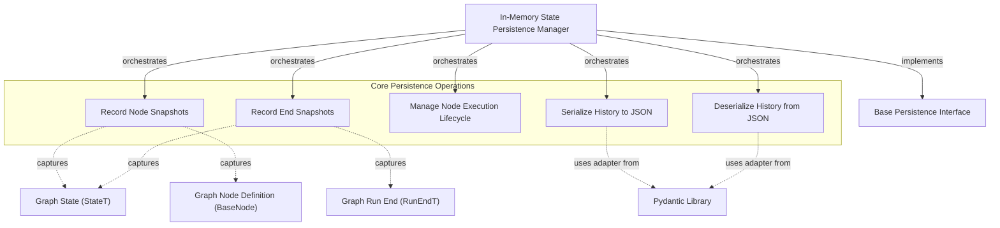

The `in_memory_state_persistence` module provides an essential in-memory mechanism for persistently storing and managing the state and execution history of a graph-based system. This module is critical for debugging, replaying executions, and understanding the flow of complex agent interactions by offering a detailed historical record of each step and its corresponding state. It acts as a lightweight, transient database for graph runs, primarily useful for development, testing, and scenarios where state persistence beyond the current process lifetime is not required.

### Architecture and Data Flow

The `in_memory_state_persistence` module, centered around the `FullStatePersistence` component, plays a crucial role in capturing and managing the dynamic state of a running graph. It provides concrete implementations for snapshotting the graph's state at various points, recording node executions, and serializing this history for inspection or re-loading.

The `FullStatePersistence` class achieves its functionality by maintaining a `history` list of `Snapshot` objects. Each `Snapshot` can be either a `NodeSnapshot`, capturing the state before a node's execution, or an `EndSnapshot`, recording the final state and result of a graph run. To ensure the integrity of historical data, the module can optionally perform deep copies of the state and nodes when snapshots are taken, preventing subsequent modifications from altering past records.

For serialization and deserialization, `FullStatePersistence` leverages Pydantic's `TypeAdapter` mechanism, allowing the entire history to be dumped to or loaded from JSON. This enables easy saving and loading of graph execution traces, which is particularly useful for debugging and analysis.

<!-- DIAGRAM_JSON
{
    "direction": "TD",
    "nodes": [
        {"id": "in_memory_manager", "label": "In-Memory State Persistence Manager", "type": "component", "link": null},
        {"id": "record_node_snapshot_op", "label": "Record Node Snapshots", "type": "component", "link": null},
        {"id": "record_end_snapshot_op", "label": "Record End Snapshots", "type": "component", "link": null},
        {"id": "manage_execution_op", "label": "Manage Node Execution Lifecycle", "type": "component", "link": null},
        {"id": "serialize_op", "label": "Serialize History to JSON", "type": "component", "link": null},
        {"id": "deserialize_op", "label": "Deserialize History from JSON", "type": "component", "link": null},
        {"id": "base_persistence_interface", "label": "Base Persistence Interface", "type": "external", "link": "base_persistence_interface.md"},
        {"id": "graph_state_t", "label": "Graph State (StateT)", "type": "external", "link": "pydantic_ai_agent_core.md"},
        {"id": "graph_node_base", "label": "Graph Node Definition (BaseNode)", "type": "external", "link": "pydantic_ai_agent_core.md"},
        {"id": "graph_run_end_t", "label": "Graph Run End (RunEndT)", "type": "external", "link": "pydantic_ai_agent_core.md"},
        {"id": "pydantic_lib", "label": "Pydantic Library", "type": "external", "link": "pydantic_ai_agent_core.md"}
    ],
    "edges": [
        {"source": "in_memory_manager", "target": "base_persistence_interface", "label": "implements"},
        {"source": "in_memory_manager", "target": "record_node_snapshot_op", "label": "orchestrates"},
        {"source": "in_memory_manager", "target": "record_end_snapshot_op", "label": "orchestrates"},
        {"source": "in_memory_manager", "target": "manage_execution_op", "label": "orchestrates"},
        {"source": "in_memory_manager", "target": "serialize_op", "label": "orchestrates"},
        {"source": "in_memory_manager", "target": "deserialize_op", "label": "orchestrates"},
        {"source": "record_node_snapshot_op", "target": "graph_state_t", "label": "captures"},
        {"source": "record_node_snapshot_op", "target": "graph_node_base", "label": "captures"},
        {"source": "record_end_snapshot_op", "target": "graph_state_t", "label": "captures"},
        {"source": "record_end_snapshot_op", "target": "graph_run_end_t", "label": "captures"},
        {"source": "serialize_op", "target": "pydantic_lib", "label": "uses adapter from"},
        {"source": "deserialize_op", "target": "pydantic_lib", "label": "uses adapter from"}
    ],
    "groups": [
        {
            "id": "core_operations",
            "label": "Core Persistence Operations",
            "role": "analytical",
            "nodes": ["record_node_snapshot_op", "record_end_snapshot_op", "manage_execution_op", "serialize_op", "deserialize_op"]
        }
    ]
}
-->

### Module Connections and Dependencies

The `in_memory_state_persistence` module is a concrete implementation within the broader [graph_persistence](graph_persistence.md) system. It directly implements the [base_persistence_interface](base_persistence_interface.md), adhering to a common contract for managing graph state history.

It depends on core concepts defined within the `pydantic_ai_agent_core` framework, specifically interacting with:
*   **Graph State (StateT)**: The generic type representing the state of the graph at any given point.
*   **Graph Node Definition (BaseNode)**: The base interface for all nodes within the graph, whose execution and state changes are snapshotted.
*   **Graph Run End (RunEndT)**: The generic type representing the final result or outcome of a graph's execution.

Additionally, it relies on the [Pydantic Library](pydantic_ai_agent_core.md) for its robust data validation and serialization capabilities, particularly for the `TypeAdapter` used in `dump_json` and `load_json` operations. This dependency ensures that the stored history conforms to defined schemas and can be reliably serialized and deserialized.

This module is designed to be a fundamental building block for any system that requires a lightweight, in-memory historical record of graph executions without external database dependencies. For durable, long-term persistence, other modules like [file_state_persistence](file_state_persistence.md) would be utilized, all adhering to the same `BasePersistenceInterface`.