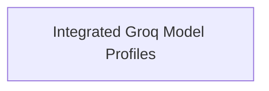

<!-- AUTO_GENERATED_PLACEHOLDER
  reason: LLM did not create .md file for this module
  module_path: pydantic_ai_agent_core/model_provider_configurations/model_profile_definitions/groq_profiles/integrated_groq_profiles
  component_count: 2
  generated_at: 2026-04-06T06:47:34.932397
  TODO: Fix LLM prompt to handle small leaf modules
-->

# Integrated Groq Model Profiles

> ⚠️ **Auto-Generated Placeholder**
> This documentation was auto-generated because the LLM failed to create it.
> Module path: `pydantic_ai_agent_core/model_provider_configurations/model_profile_definitions/groq_profiles/integrated_groq_profiles`

Manages Groq model profiles that integrate with other AI providers like MoonshotAI and Meta, extending their capabilities.

## Components

This module contains 2 component(s):

- `pydantic_ai_slim.pydantic_ai.providers.groq.groq_moonshotai_model_profile`
- `pydantic_ai_slim.pydantic_ai.providers.groq.meta_groq_model_profile`

## Structure

---
*Auto-generated placeholder. See sync_issues.json for details.*
