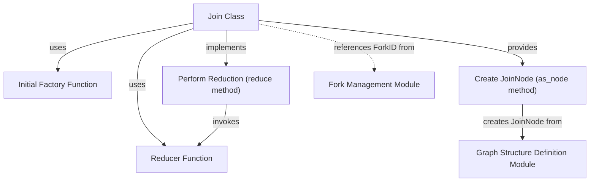

# Module: `join_operations`

The `join_operations` module is a critical component within the `pydantic_ai_agent_core`'s graph execution system, specifically designed to synchronize and aggregate results from parallel execution paths. In complex agent workflows, tasks can often be forked into multiple parallel branches for concurrent processing. This module provides the `Join` class, which acts as a rendezvous point, ensuring that all necessary parallel results are collected and combined into a single, coherent output before the workflow can proceed.

This module is essential for managing the flow of data in non-linear graphs, enabling robust and efficient parallel processing by defining how disparate results are brought together. It ensures data consistency and allows for the creation of sophisticated, multi-threaded agent behaviors.

## Core Components

### `Join`

The `Join` class is the central mechanism for synchronizing and aggregating outputs from parallel execution paths within a graph. It is a generic class parameterized by the graph state (`StateT`), dependencies (`DepsT`), input type (`InputT`), and output type (`OutputT`).

**Purpose:**
-   To define how results from multiple parallel branches are combined.
-   To manage the initialization of the aggregation process.
-   To provide a structured way to integrate joined data back into the main workflow.

**Key Attributes:**

*   `id` (`JoinID`): A unique identifier for this specific join operation.
*   `_reducer` (`ReducerFunction[StateT, DepsT, InputT, OutputT]`): A function responsible for combining the incoming inputs (`InputT`) with the current aggregated output (`OutputT`) to produce a new aggregated output. This function can optionally take a `ReducerContext` for more advanced state or dependency-aware reductions.
*   `_initial_factory` (`Callable[[], OutputT]`): A factory function that produces the initial value for the aggregated output when a join operation begins.
*   `parent_fork_id` (`ForkID | None`): An optional identifier for the `Fork` operation that initiated the parallel paths this `Join` is intended to synchronize. This helps in correctly associating a join with its corresponding fork.
*   `preferred_parent_fork` (`Literal['closest', 'farthest']`): Specifies a strategy for associating the join with a parent fork if `parent_fork_id` is not explicitly provided.
    *   `'closest'`: Attempts to join the most recently active or nearest fork in the execution path.
    *   `'farthest'`: Attempts to join the oldest or farthest active fork in the execution path.

**Key Methods:**

*   `reducer`: A property that exposes the underlying `ReducerFunction` used by the join.
*   `initial_factory`: A property that exposes the factory function used to create the initial aggregated value.
*   `reduce(self, ctx: ReducerContext[StateT, DepsT], current: OutputT, inputs: InputT) -> OutputT`:
    This method executes the `_reducer` function. It intelligently determines whether the reducer requires a `ReducerContext` based on its signature and calls it accordingly. This allows for flexible reducer implementations that can either operate purely on `current` and `inputs` or leverage additional context and dependencies.
*   `as_node(self, inputs: InputT | None = None) -> JoinNode[StateT, DepsT]`:
    This method transforms the `Join` instance into a `JoinNode`, which is a concrete step within the graph execution engine.
    *   `inputs`: Optional input data to bind to this node.
    *   Returns a [`JoinNode`][graph_structure_definition.md] instance, ready to be incorporated into the graph structure.

## How it Works

When a graph execution encounters a `Fork` operation, it branches into multiple parallel paths. Each path can execute independently. The `Join` operation is then used to bring these paths back together. As each parallel path completes, its output is fed into the `Join`'s `reduce` method. The `ReducerFunction` iteratively combines these outputs, starting with an initial value provided by the `_initial_factory`, until all relevant parallel paths have contributed. Once all required inputs are received and aggregated, the `Join` node produces its final output, allowing the subsequent nodes in the graph to execute.

## Relationships to Other Modules

*   **`fork_management`**: The `join_operations` module is tightly coupled with `fork_management`. `Join` operations often follow `Fork` operations, explicitly or implicitly referencing the parallel branches created by a fork. The `parent_fork_id` and `preferred_parent_fork` attributes directly manage this relationship.
*   **`graph_structure_definition`**: The `as_node` method converts a `Join` instance into a `JoinNode`, which is a fundamental building block defined within the `graph_structure_definition` module. This module defines how `Join` operations are represented and integrated into the overall graph structure.
*   **`graph_execution_engine`**: Once a `Join` is represented as a `JoinNode`, the `graph_execution_engine` is responsible for its actual execution, including managing the incoming parallel results and invoking the `reduce` method.

<!-- DIAGRAM_JSON
{
    "direction": "TD",
    "nodes": [
        {"id": "join_class", "label": "Join Class", "type": "component", "link": null},
        {"id": "reducer_func", "label": "Reducer Function", "type": "component", "link": null},
        {"id": "initial_factory_func", "label": "Initial Factory Function", "type": "component", "link": null},
        {"id": "perform_reduction", "label": "Perform Reduction (reduce method)", "type": "component", "link": null},
        {"id": "create_join_node", "label": "Create JoinNode (as_node method)", "type": "component", "link": null},
        {"id": "fork_management", "label": "Fork Management Module", "type": "external", "link": "fork_management.md"},
        {"id": "graph_structure_definition", "label": "Graph Structure Definition Module", "type": "external", "link": "graph_structure_definition.md"}
    ],
    "edges": [
        {"source": "join_class", "target": "reducer_func", "label": "uses"},
        {"source": "join_class", "target": "initial_factory_func", "label": "uses"},
        {"source": "join_class", "target": "perform_reduction", "label": "implements"},
        {"source": "join_class", "target": "create_join_node", "label": "provides"},
        {"source": "perform_reduction", "target": "reducer_func", "label": "invokes"},
        {"source": "create_join_node", "target": "graph_structure_definition", "label": "creates JoinNode from"},
        {"source": "join_class", "target": "fork_management", "label": "references ForkID from"}
    ],
    "groups": []
}
-->
