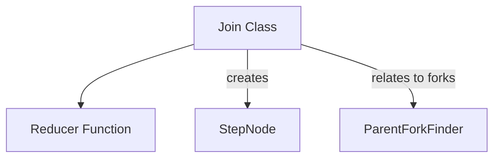

# Join Operations Module

## Introduction

The `join_operations` module, part of the `pydantic_graph.beta` package, provides the `Join` class, which is fundamental for synchronizing and aggregating parallel execution paths within a graph. It enables the combination of outputs from various concurrent branches into a single, cohesive result using a defined reduction strategy.

## Core Functionality

The `Join` class is designed to manage the complexities of combining data streams from divergent graph paths. It specifies how and where to merge these paths, making it a critical component for building complex, branching workflows in `pydantic_graph`.

### `Join` Class

```python
class Join(Generic[StateT, DepsT, InputT, OutputT]):
    # ... (code as provided)
```

This class represents a join operation within a graph. It is responsible for:

*   **Defining Reduction Logic**: Utilizes a `ReducerFunction` to specify how inputs from parallel paths are combined into a single output.
*   **Managing Fork Dependencies**: Can be optionally linked to a `parent_fork_id` to indicate which specific fork it is intended to join, with a preference for either the `closest` or `farthest` parent fork.
*   **Initializing Reducers**: Provides an `initial_factory` to create the initial state for the reduction process.
*   **Node Creation**: Offers a method `as_node` to transform the join operation into a [`JoinNode`][graph_structure_definition.md], which is a concrete step within the graph's execution flow.

#### Type Parameters:

*   `StateT`: The type of the overall graph state.
*   `DepsT`: The type of the dependencies available during graph execution.
*   `InputT`: The type of input data that the join operation expects to receive from parallel paths.
*   `OutputT`: The type of the aggregated output produced by the join.

#### Attributes:

*   `id` (JoinID): A unique identifier for this join operation.
*   `_reducer` (ReducerFunction): The function used to combine inputs.
*   `_initial_factory` (Callable[[], OutputT]): A factory function to produce the initial value for the reduction.
*   `parent_fork_id` (ForkID | None): An optional identifier of the specific fork this join intends to close. Refer to [Graph Analysis and Rendering](graph_analysis_and_rendering.md) for more details on fork management.
*   `preferred_parent_fork` (Literal['closest', 'farthest']): Dictates whether the join should prioritize the closest or farthest active parent fork if `parent_fork_id` is not explicitly set.

#### Methods:

*   `reducer` (property): Returns the `_reducer` function.
*   `initial_factory` (property): Returns the `_initial_factory` function.
*   `reduce(self, ctx: ReducerContext[StateT, DepsT], current: OutputT, inputs: InputT) -> OutputT`:
    Executes the reduction logic. It handles both plain reducer functions (taking `current` and `inputs`) and context-aware reducer functions (taking `ctx`, `current`, and `inputs`).
*   `as_node(self, inputs: InputT | None = None) -> JoinNode[StateT, DepsT]`:
    Converts this `Join` instance into a `JoinNode`, a type of [`StepNode`][graph_structure_definition.md], optionally binding initial inputs to it. This allows the join operation to be integrated into the graph's executable structure.

## Architecture and Component Relationships

The `join_operations` module is a leaf module within the `graph_path_and_flow` module, playing a crucial role in defining graph structure, especially concerning the merging of parallel execution paths. It depends on core graph components for defining steps and managing forks.

<!-- DIAGRAM_JSON
{
    "direction": "TD",
    "nodes": [
        {"id": "Join", "label": "Join Class", "type": "component", "link": null},
        {"id": "ReducerFunction", "label": "Reducer Function", "type": "component", "link": null},
        {"id": "StepNode", "label": "StepNode", "type": "external", "link": "graph_structure_definition.md"},
        {"id": "ParentForkFinder", "label": "ParentForkFinder", "type": "external", "link": "graph_analysis_and_rendering.md"}
    ],
    "edges": [
        {"source": "Join", "target": "ReducerFunction"},
        {"source": "Join", "target": "StepNode", "label": "creates"},
        {"source": "Join", "target": "ParentForkFinder", "label": "relates to forks"}
    ],
    "groups": []
}
-->


## Integration with the Overall System

This module is integral to the `pydantic_graph_beta` system, specifically enabling advanced graph structures that involve parallel execution and subsequent merging. The `Join` class facilitates the creation of robust and flexible workflows by providing a structured way to handle the synchronization of concurrent paths. Its interaction with [`StepNode`][graph_structure_definition.md] ensures that join operations are seamlessly incorporated into the graph's executable plan, while its awareness of fork management (via `ForkID` and `ParentForkFinder` within [Graph Analysis and Rendering](graph_analysis_and_rendering.md)) underpins the system's ability to navigate and manage complex branching logic. This makes `join_operations` a cornerstone for building sophisticated, multi-path intelligent agents and data processing pipelines.
